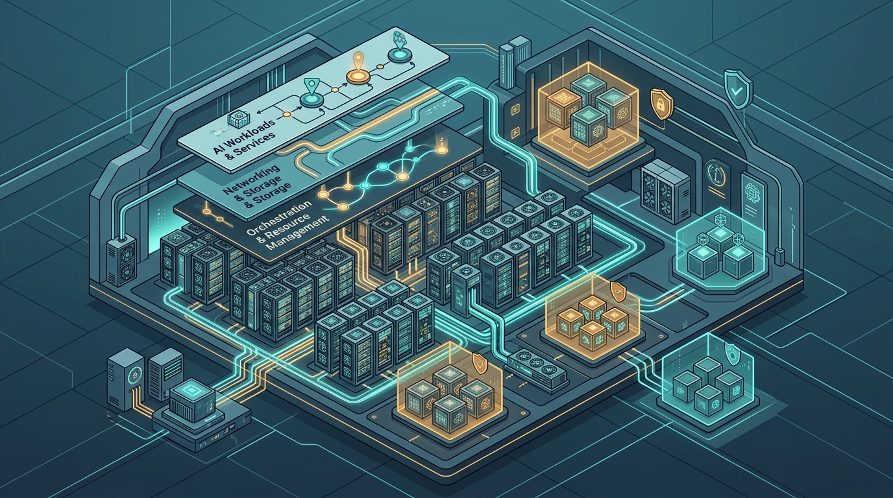

En el **VMware Explore 2026** de Las Vegas, Broadcom presentó **VMware AI Factory**, la fundación *software-defined* de su **VMware Private AI Cloud**. El pitch es directo: las empresas quieren correr IA donde ya viven sus datos, pero el camino del metal al modelo sigue siendo lento, caro y enredado.

La respuesta de Broadcom es automatizar ese trayecto. Según Paul Turner (CPO de la división VMware Cloud Foundation), la automatización del stack puede recortar el tiempo desde un servidor bare-metal hasta servir el primer modelo de **semanas a horas**, cubriendo el aprovisionamiento de hardware, el habilitado del stack de software y las operaciones de ciclo de vida de punta a punta.

### Lo que hay adentro

Tres piezas destacan desde el ángulo de infra y seguridad:

- **Multi-tenant Model Sharing:** los modelos se comparten entre unidades de negocio a través de namespaces aislados, preservando la privacidad de datos y evitando despliegues redundantes que queman GPU.
- **AI Gateway:** centraliza la gobernanza entre on-prem y cloud con enrutamiento inteligente de prompts, rate limiting de tokens y autorización a nivel de aplicación.
- **Secure AI Sandboxes y Governance:** espacios de contenedores virtualizados que aíslan la ejecución de código generado por agentes, con una capa de control que define cómo se invocan los agentes, qué herramientas pueden usar y cómo se validan sus outputs antes de actuar.

La GPU deja de ser un recurso dedicado por workload: se poolea y se comparte entre equipos, y una **galería de modelos unificada** da visibilidad centralizada sobre despliegues, flujos RAG, throughput de tokens, latencia y utilización de cómputo.

### El mapa completo del anuncio

AI Factory no vino solo. Broadcom también presentó **AgentMinder**, una solución de gobernanza y control en runtime para agentes de IA, y **AI-ready Data Foundations** en la plataforma VMware Tanzu. Es decir: la apuesta completa de Broadcom por posicionarse como el "sistema operativo" del AI empresarial on-prem, justo en un momento donde las empresas miran con recelo el costo de la nube pública para cargas de IA intensivas.

La lectura es clara: Broadcom no quiere venderte solo vSphere. Quiere ser la capa donde tu empresa despliega, gobierna y asegura agentes de IA sobre infraestructura que ya controlas.
