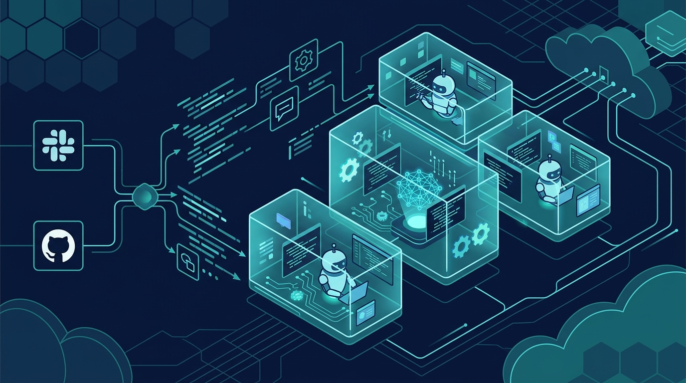

Correr agentes de IA en el notebook del developer ya no daba el ancho. DoorDash lo dejó claro con **Flux**, su plataforma cloud para cargas de agentes de ingeniería, que automatizó **130.000 tareas en un solo mes** durante 2026.

El salto en escala no es menor: Flux soporta más de **25.000 code reviews automatizadas por semana**, más de **300 playbooks** y más de **10.000 invocaciones semanales**, con flujos que corren sin supervisión y en paralelo.

### Por qué sacaron a los agentes del laptop

La ejecución local venía con límites que se notan en producción:

- **CPU y memoria** acotadas a la máquina del dev.
- Dependencia de que el **dispositivo siga conectado**.
- Agentes autónomos con **acceso a credenciales y sistemas internos** que ya tenía el developer.
- Dificultad para **monitorear** dónde corren los agentes, qué sistemas tocan y en nombre de quién operan.

### La arquitectura, en cuatro piezas

Flux se apoya en cuatro primitivas de plataforma:

- **Cloud sandboxes** con micro-VMs **Firecracker** para aislar cada carga.
- Un **gateway MCP** que controla el acceso a sistemas internos.
- **Playbooks reutilizables** que definen el trabajo.
- **Superficies de invocación** para disparar flujos desde Slack, GitHub, cron, la CLI o interfaces conversacionales.

Según el arquitecto de seguridad Radoslav Krehlik, los agentes se pueden gatillar desde Slack, GitHub o jobs programados, manteniendo los guardarraíles de seguridad enterprise de DoorDash intactos.

### El patrón que se repite

Esto calza con la tesis que venimos viendo todo el año: los agentes de coding están dejando el laptop y mudándose a plataformas gestionadas con sandboxing fuerte, gobernanza de identidad y observabilidad de qué hace cada agente. DoorDash no es el primero, pero los números de Flux son de los más concretos que hemos visto públicos hasta ahora.
