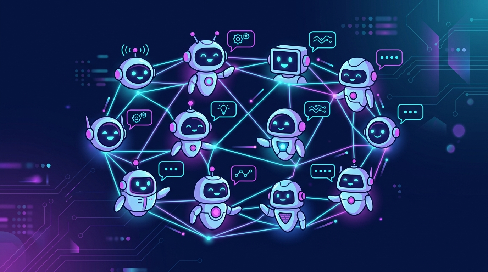

Nous Research sacó **Hermes Agent v0.21.0**, bautizado "The Pantheon Release", y el foco está claro: dejar de ver a los agentes como asistentes individuales y empezar a tratarlos como **una red de identidades que conversan entre sí**.

## Los números

Esto no es un parche menor. Desde v0.20.0, el release acumula **2.475 PRs mergeados y ~5.800 commits de más de 760 contribuidores**. Un ritmo de desarrollo que empieza a parecerse al de proyectos cloud-native consolidados, no a un tool de nicho.

## Lo nuevo que importa

- **Bot Mode integrado al Desktop**: cada perfil se convierte en un **agente con nombre propio y su propia "cara"**. Puedes armar **group chats donde los bots se hablan entre ellos** (y contigo), y mencionarlos con `@` como si fueran colegas en un canal.
- **Agent-to-Agent comms**: comunicación nativa entre agentes, sin pasar por un orquestador externo.
- **Persistent multi-gateway connections**: conexiones estables a múltiples proveedores, sin reconectar a cada rato.
- **Subagent steering**: control fino sobre subagentes que delegan tareas entre sí.
- **Platform de plugins** y **conectores expandidos**: más superficie para extender el agente sin tocar el core.
- **CLI mejorado** y reducción del contexto por defecto (más barato de correr para tareas simples).

## Por qué importa

La tendencia es evidente: los agentes ya no se construyen como un prompt gigante, sino como **equipos de roles que negocian y delegan**. Nous está empujando ese modelo hacia el desktop y los flujos de dev, justo en el momento en que herramientas tipo Claude Code u OpenClaw compiten por ser la "casa" de esos equipos.

El riesgo sigue siendo el de siempre: más autonomía y más conversaciones entre bots = más superficie para que algo se descarrile sin que un humano lo note. La gobernanza de agentes —el tema recurrente de este mes— vuelve a aparecer.

Fuente: [Nous Research (X)](https://x.com/NousResearch/status/2094515104670715940) · [GitHub](https://github.com/nousresearch/hermes-agent)
