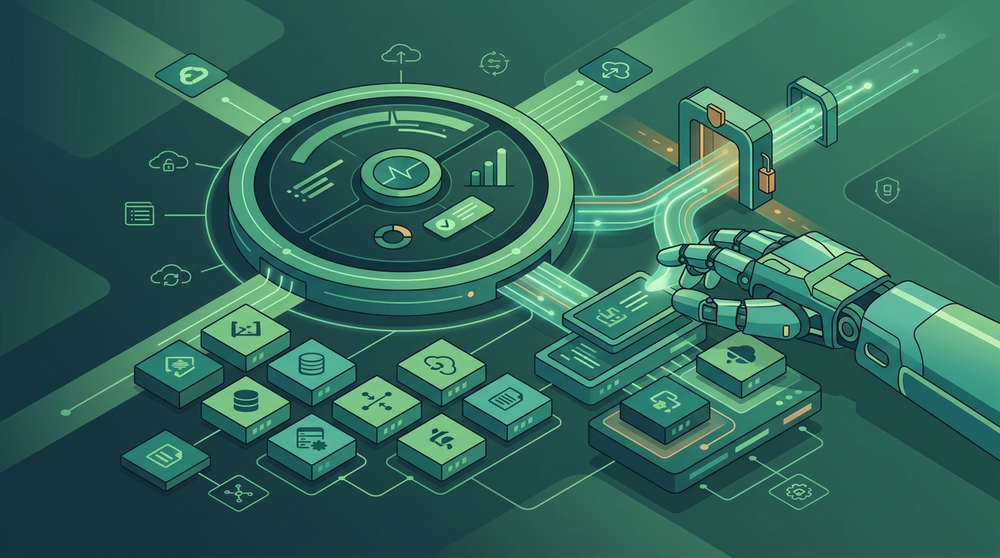

HashiCorp está reposicionando **HCP Terraform** como la capa de gobernanza y control para una nueva generación de **infraestructura manejada por IA**. El argumento de fondo es simple: con los agentes de código disparando cambios a velocidad de máquina, el gran desafío dejó de ser *escribir* la configuración y pasó a ser *verificarla y ejecutarla con seguridad*.

## El modelo propuesto

La idea central es que un agente de IA pueda **escribir Terraform, abrir cambios y gatillar runs de forma autónoma**, pero siempre pasando por el mismo control plane que cualquier otro cambio de infraestructura. En la práctica:

- **Módulos aprobados y estándares organizacionales** como contexto autoritativo para el agente.
- **Policy-as-code y run tasks** que evalúan los cambios propuestos.
- **Identidades acotadas por proyecto** que restringen qué puede tocar un agente.
- **Proyectos y workspaces aislados** para limitar el radio de impacto.
- **Historial de runs** que preserva planes, decisiones de política, aprobaciones y registros de ejecución.

## El principio de oro

HashiCorp lo resume en una frase que vale la pena subrayar: **el agente propone, Terraform gobierna**. Un agente puede generar configuración, validarla y explicar sus cambios, pero **no debería poder aprobar su propio trabajo, debilitar políticas, adquirir credenciales amplias ni saltarse los controles de despliegue**.

También apuestan por credenciales de corta vida: identidades por proyecto y credenciales OIDC emitidas para un run específico y revocadas después. Si un agente se ve comprometido, el radio de impacto queda chico.

## Lo que significa para platform engineering

La implicancia más profunda es para los equipos de plataforma. Si la IA reduce el tiempo de escribir IaC, el trabajo del equipo de plataforma se mueve de *producir config* a *diseñar los guardarraíles*: las políticas, identidades y módulos que le dan contexto y límites a los agentes. Es un cambio de foco silencioso pero grande, y Terraform quiere ser la pieza que lo sostenga.
