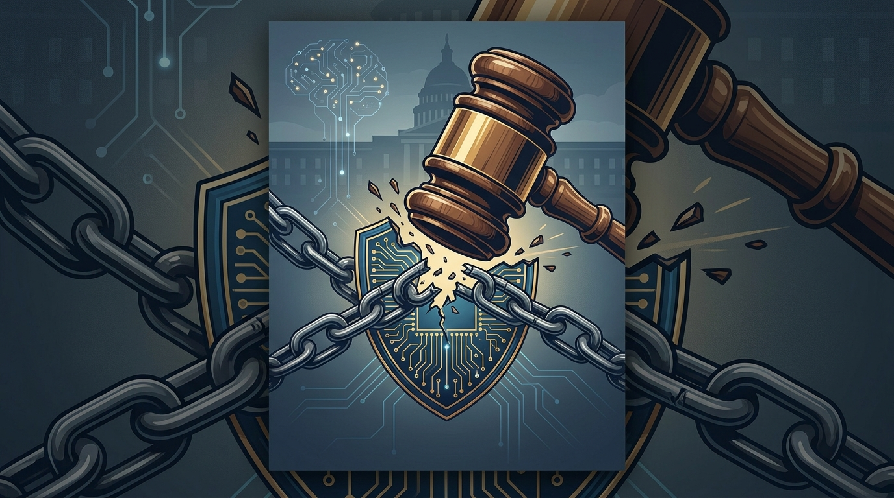

Un tribunal federal le acaba de bajar el pulgar al Pentágono. La jueza **Rita Lin** (Distrito Norte de California) declaró inconstitucional la etiqueta de "riesgo de cadena de suministro" que el Departamento de Defensa le clavó a Anthropic este año. Es uno de los primeros choques legales serios sobre cuánto puede castigar el gobierno a una empresa de IA por negarse a sus exigencias.

## Qué fue lo que pasó

El resumen en una línea: Anthropic se negó a que Claude se usara para **armas autónomas letales** y **vigilancia masiva doméstica**. El gobierno de Trump respondió etiquetándola como "riesgo de cadena de suministro", una categoría pensada para amenazas de seguridad nacional tipo Huawei o Kaspersky. La jugada, además de manchar la reputación, bloqueaba de facto que contratistas de defensa trabajaran con la empresa.

La jueza Lin falló que esa etiqueta violó la **Primera Enmienda** (libertad de expresión) y la **Quinta Enmienda** (debido proceso). En cristiano: el Estado no puede castigar a una empresa por ejercer su derecho a decir "no" sobre cómo se usa su tecnología.

## Por qué importa (y no es solo política)

Hay tres cosas gruesas acá:

1. **Precedente para toda la industria**: Anthropic es la primera empresa estadounidense en recibir ese rótulo públicamente, y ahora la corte dice que fue ilegal. Queda un precedente contra la retaliación gubernamental por posiciones de principios.
2. **El timing no es casual**: el fallo llega en la antesala del IPO de Anthropic, del que se habla podría rondar los **2 billones de dólares**. Tener el rótulo encima era un lastre reputacional enorme justo cuando van a salir a la bolsa.
3. **El contexto sigue tenso**: el Pentágono ya anunció que va a sacar a Claude de sus plataformas a fines de septiembre, y en paralelo está desplegando **ChatGPT (OpenAI) y Grok (xAI)** a unos 3 millones de personal militar y civil. El fallo limpia el nombre, pero el contrato ya se fue.

## Lo que NO resuelve el fallo

Ojo, que acá no todo es color de rosa. El fallo invalida la etiqueta, pero **no obliga** al Pentágono a seguir usando Claude ni a reabrir los contratos. El daño reputacional y comercial ya está hecho, y la decisión de migrar a otros proveedores sigue en pie. La jueza frenó la retaliación, pero no la reemplazó con un escudo total.

Para el mundo infra/DevOps/IA la lección es incómoda y clara: **las decisiones de "con quién trabajo y para qué" ahora tienen consecuencias legales, contractuales y de mercado**. El gobierno va a empujar para que la IA se use en defensa; las empresas van a decidir si se suben o no. Y esa tensión recién empieza.
