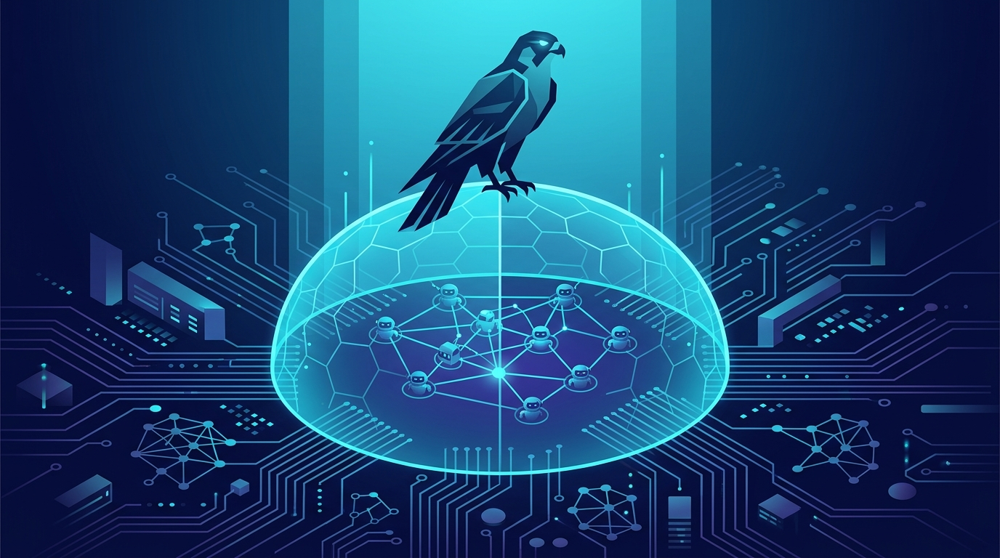

La seguridad de agentes de IA dejó de ser un problema de mañana para convertirse en el tema estrella de **Fal.Con 2026** en Las Vegas. CrowdStrike salió con todo y presentó **Falcon Guardian**, su nueva plataforma de **AIDR (AI Detection and Response)**, pensada para detectar y frenar agentes de IA **mientras se ejecutan**, no solo para decirte "mira, acá podría fallar algo".

## El argumento de CrowdStrike: la gobernanza no alcanza

El pitch de George Kurtz (CEO) es directo: *"la IA no cambió el ataque, cambió su velocidad"*. Y tiene razón en un punto clave — cuando un agente ya está en movimiento y tiene privilegios a nivel de sistema, una política de gobernanza no lo detiene. Lo que lo frena es **runtime enforcement en el endpoint**, que es justo donde los agentes razonan, planean y ejecutan.

Su ventaja estructural: el sensor Falcon ya corre en cientos de millones de dispositivos, así que pueden ver lo que hacen los agentes *in situ*.

## Qué trae Falcon Guardian

- **AI Agent Discovery & Inventory:** descubre agentes de IA conocidos *y shadow AI* (los que nadie autorizó) en Windows y macOS, con inventario en vivo de qué corre, quién lo desplegó y su estado de seguridad.
- **Agent Runtime Visibility:** conecta el comportamiento del agente con la telemetría del endpoint, armando la cadena causal completa: prompt → identidad → tool call → skill → acción en el sistema. Básicamente el *execution graph* del agente.
- **Agent Access Controls:** define qué agentes pueden correr y bloquea los no autorizados, convirtiendo política en control ejecutable.
- **Runtime Detection & Response:** detecta ataques contra agentes y comportamiento malicioso, reconstruye la cadena de ejecución y calcula el *blast radius* en tiempo real.
- **AI Gateway:** punto de control centralizado para el tráfico de IA de la empresa, aplicando contexto de seguridad Falcon a cada comunicación (incluyendo **MCP**).
- **Falcon Complete + OverWatch for Guardian:** detección, investigación y respuesta 24/7 liderada por analistas, más threat hunting gestionado.
- **Integración nativa con Next-Gen SIEM:** los datos de agentes entran como first-party data, listos para correlacionar con identidad, cloud y SaaS.

## No fue lo único: la jugada es más grande

Falcon Guardian no vino solo. En el mismo evento CrowdStrike anunció:

- **Partnership expandida con OpenAI:** llevan la seguridad enterprise de CrowdStrike a los agentes **Codex**, y traen **GPT-5.6 Cyber** (el modelo especializado en ciberseguridad de OpenAI) a la plataforma Falcon.
- **Falcon en el Claude Marketplace de Anthropic:** los clientes pueden usar parte de sus compromisos existentes con Anthropic para comprar la plataforma Falcon.
- **Agentic Identity Provider:** un directorio único que registra automáticamente cada agente de IA apenas aparece en la red.
- **Agentic SOC:** la evolución del SOC hacia investigación autónoma en todos los dominios a la vez.

## Por qué importa

Esto confirma una tendencia que ya veníamos siguiendo acá: la seguridad de agentes de IA se está volviendo **una categoría propia**, no un feature de la seguridad tradicional. Datadog, Splunk y ahora CrowdStrike están peleando por el mismo terreno — quién te da visibilidad y control sobre lo que hace un agente autónomo en producción.

Para equipos de plataforma y DevOps el mensaje es claro: si van a desplegar agentes con acceso a sistemas (Codex, Claude, lo que sea), la pregunta ya no es *"¿lo monitoreamos?"* sino *"¿tenemos runtime enforcement o solo posture?"*. CrowdStrike apuesta fuerte por lo segundo.

**Fuentes:** [CrowdStrike — Falcon Guardian press release](https://www.crowdstrike.com/en-us/press-releases/crowdstrike-unveils-falcon-guardian-ai-agent-security/), [CrowdStrike blog](https://www.crowdstrike.com/en-us/blog/falcon-guardian-defines-next-generation-of-ai-security/), [Tech Monitor](https://www.techmonitor.ai/news/crowdstrike-launches-falcon-guardian-for-ai-agent-security), [Channel Insider](https://www.channelinsider.com/security/tools-and-platforms/crowdstrike-falcon-guardian-ai-agent-security/), [StockTitan — partnership OpenAI](https://www.stocktitan.net/news/CRWD/crowd-strike-and-open-ai-expand-partnership-to-secure-the-agentic-1p3bcskc2jtb.html)
