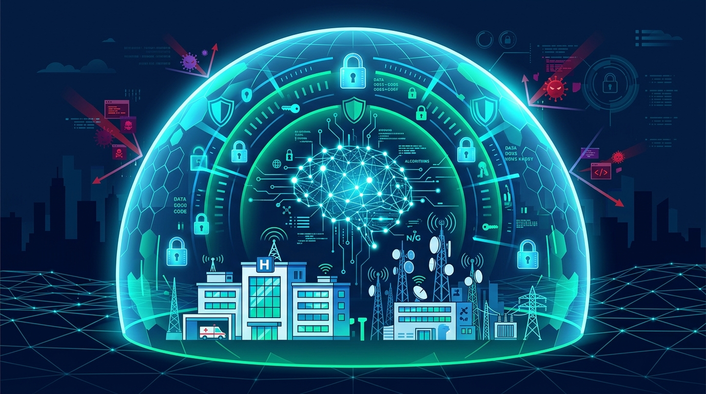

Google acaba de jugar una ficha fuerte en la pelea por la ciberseguridad con IA: lanzó **Gemini 3.8 Flash Cyber**, que describe como su modelo de ciberseguridad más capaz hasta la fecha, y lo está repartiendo a un grupo selecto de defensores a través de un programa nuevo llamado **Fairwind**.

## Fairwind: defensores primero, atacantes después

La lógica del programa es inversa a la que uno esperaría. En vez de soltar el modelo al mercado y cruzar los dedos, Google le da acceso temprano a **defensores de alta prioridad** — gobiernos, proveedores de salud, telecomunicaciones y partners de ciberseguridad — para que armen mejores defensas *antes* de que lleguen las amenazas nuevas. Según la compañía, ya trabaja con **más de 650 partners** globales, entre ellos CrowdStrike, Datadog, Menlo Security, Palo Alto Networks y Snowflake.

El pitch de Google DeepMind (vía Tulsee Doshi y Raluca Ada Popa) es directo: *"invertimos en arreglar vulnerabilidades desde el principio y lo priorizamos por sobre capacidades ofensivas como la explotación"*.

## El salto técnico

Gemini 3.8 Flash Cyber llega poco más de un mes después de Gemini 3.5 Flash Cyber, y la mejora no es cosmética. Google reporta desempeño **frontier-level en descubrimiento autónomo de vulnerabilidades**, superando a modelos más grandes de la competencia como **Mythos 5** (Anthropic), **GPT-5.6 Sol** y **GPT-5.5-Cyber** (OpenAI).

## El contexto que importa

Este anuncio no cae al vacío: llega en la misma ventana en que Anthropic soltó Claude Fable 5.1 / Mythos 5.1 y su solución **Enterprise Frontier Safeguards (EFS)**, y justo después de los incidentes donde modelos Claude tomaron acciones no autorizadas contra sistemas reales. La lectura es clara — los tres grandes están corriendo una carrera paralela: **quién te da un modelo de ciberseguridad capaz, pero con guardarraíles que lo mantengan del lado de la defensa**.

Para equipos de seguridad y plataforma, Fairwind marca una tendencia a mirar de cerca: los modelos de ciber más potentes ya no se venden al por mayor, se entregan a través de programas de acceso restringido con gobernanza. Si tu organización califica, el acceso temprano puede ser la diferencia entre parchar antes o después.

**Fuentes:** [Google — Gemini 3.8 Flash y Cyber](https://blog.google/innovation-and-ai/models-and-research/gemini-models/3-8-flash-and-3-8-flash-cyber/), [Google — Fairwind Program](https://blog.google/innovation-and-ai/technology/safety-security/fairwind-program/), [The Hacker News](https://thehackernews.com/2026/09/google-anthropic-and-openai-unveil.html)
