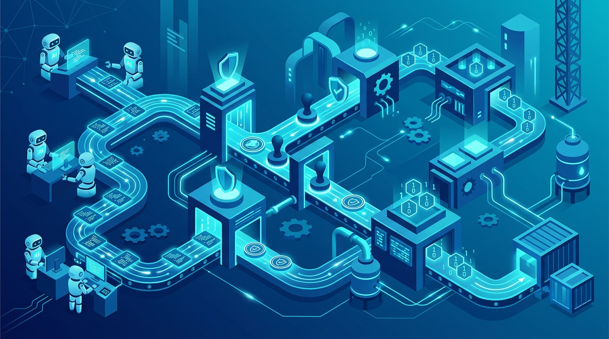

En **swampUP 2026**, JFrog salió a marcar cancha con un problema que se viene arrastrando hace meses en el mundo DevOps: los agentes de IA ya escriben, commitean y shipean código a velocidad de máquina, pero la gobernanza y el compliance siguen corriendo a velocidad de humano. Su respuesta es **JFrog AppTrust**, una nueva tanda de capacidades de **DevGovOps** que mete el cumplimiento *dentro* del release, no como una auditoría al final.

## El diagnóstico de Shlomi Ben Haim

El CEO de JFrog lo puso en términos bien concretos: *"los agentes autónomos son hoy miembros de primera clase de los equipos de desarrollo, y la gobernanza todavía se hace en un spreadsheet o en una auditoría trimestral"*. La tesis es simple — si el código lo genera un agente, el compliance no puede ser algo que haces *después*; tiene que estar embebido en el artefacto desde el minuto uno.

Y no es postureo regulatorio: el **EU Cyber Resilience Act (CRA)** mete multas de hasta €15 millones o 2,5% de la facturación global, y la **NIS2** puede caer con responsabilidad personal de los ejecutivos. La letra chica ahora es con nombre y apellido.

## Las cuatro patas del DevGovOps

AppTrust organiza la gobernanza en cuatro pilares continuos:

- **Codify — políticas como código:** un *AI-assisted Policy-as-Code Playground* que deja escribir reglas de gobernanza en inglés plano, sin tocar Rego, y validarlas contra versiones reales de la app antes de mandarlas a producción. Las políticas validadas se guardan como templates reutilizables.
- **Attest — evidencia automática:** *Prompt-to-Release Traceability*, que junta aprobaciones, builds, scans y promociones sin logging manual. Conecta la intención del agente con el artefacto que efectivamente salió, armando el audit trail completo de cada decisión de un agente.
- **Enforce — guardarraíles a velocidad de máquina:** frameworks *Out-of-the-Box* alineados con estándares (ya hay templates para CRA y NIST SSDF) que se activan con un click.
- **Monitor — gobernanza post-release:** visibilidad continua de cada versión activa en producción dentro de su ventana de soporte.

## Por qué importa

Esto confirma algo que venimos viendo en Ping Diario: la seguridad de la cadena de suministro está mutando desde "escaneo de vulnerabilidades" hacia **gobernanza continua embebida**, con los agentes de IA como el nuevo driver. JFrog no está solo — CrowdStrike, Datadog y Splunk están empujando categorías similares desde ángulos distintos —, pero acá el ángulo es el *provenance* del software: de dónde salió cada binario y si puedes probarlo ante un regulador.

AppTrust estará disponible para clientes de la plataforma JFrog en el **Q3 2026**. Para equipos que ya corren agentes en el pipeline, el mensaje es claro: la pregunta ya no es si el agente puede shipear, sino si puedes demostrar que lo que shipeó cumple.

**Fuentes:** [JFrog press release](https://jfrog.com/press-room/jfrog-delivers-devgovops-at-scale-continuous-compliance-for-the-ai-era-software-supply-chain/), [JFrog DevGovOps](https://jfrog.com/devgovops/), [JFrog AppTrust](https://jfrog.com/apptrust/)
