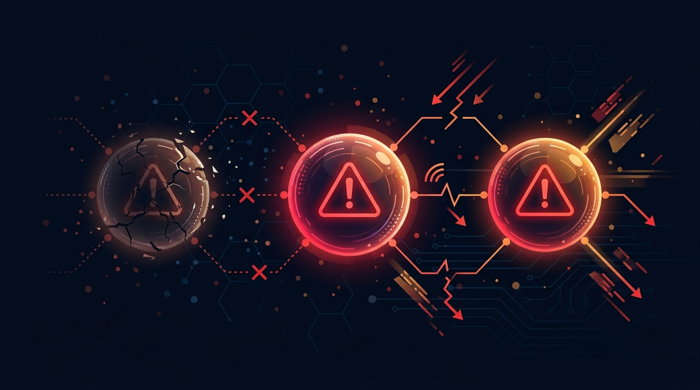

El jueves 3 de septiembre no fue un buen día para hablar con máquinas. **ChatGPT, Claude y Grok** sufrieron interrupciones casi al mismo tiempo, con picos que en un momento superaron los **35.000 reportes** de usuarios en Downdetector solo para ChatGPT en EE.UU.

### Qué pasó exactamente

- **OpenAI:** reportó "errores elevados" en ChatGPT y Codex. Un vocero reconoció a The Register que un **"routing error"** iniciado cerca de las 7:43 a.m. PT dejó sin servicio a algunos usuarios en varias plataformas. Aplicaron un fix y siguieron monitoreando.
- **Anthropic:** su status page primero apuntó a varios modelos (Mythos/Fable 5.1, Fable 5, Opus 5, Opus 4.8 y 4.6) y después acotó el problema a **Opus 4.8 y Opus 5**, que seguían con interrupciones mientras el resto ya se recuperaba.
- **xAI/Grok:** reconoció "issues" en la web y en la app móvil, y dijo estar trabajando en el problema.
- **Gemini:** Google no confirmó outage, aunque hubo un alza de reportes en el mismo horario, y algunos apuntaron a **Microsoft Azure** como posible factor común.

### ¿Misma causa o coincidencia?

Ahí está el matiz: **no hay evidencia de que las tres caídas tuvieran la misma causa técnica**. Lo más probable, según los reportes, es una combinación de incidentes independientes que coincidieron en el tiempo. Anthropic atribuyó su parte a un problema de infraestructura propio.

Pero el episodio deja una lectura incómoda: cuando la mayoría de las apps de IA generativa dependen de un puñado de proveedores (y a veces de la misma infraestructura cloud debajo), una mañana de fallos se convierte en un apagón de facto para el usuario final.

### La lección para empresas

Para los equipos que ya incrustaron estos modelos en flujos críticos, la caída dejó una advertencia en limpio: **no hay que depender de un solo proveedor de IA sin un plan de continuidad documentado**. Si tu producto llama a Claude, ChatGPT o Grok como si fuera un servicio más de tu stack, este jueves fue un recordatorio de que todavía son, a fin de cuentas, terceros con su propia probabilidad de caerse.
