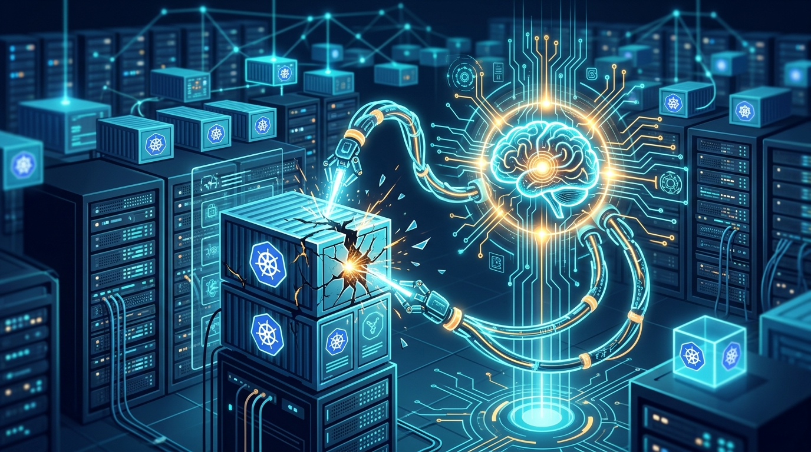

La startup israelí **DataAgent** salió del modo stealth con **US$10 millones** en financiamiento pre-seed para empujar un agente de IA open source que diagnostica y repara fallas de producción directamente dentro de los clústeres de Kubernetes de sus clientes. La gracia: no se queda en el "te aviso que algo está roto", sino que intenta arreglarlo.

La empresa fue fundada en enero de 2026 por **Ishay Yaari** (CEO) y **Nati Shalom** (CTO), dos viejos conocidos del mundillo open source que venían de **Cloudify Platform**, la compañía de orquestación cloud que Dell se comió en 2023. Con esa plata, DataAgent apunta a acelerar la adopción de clientes en Norteamérica.

¿Cómo funciona? El agente analiza el estado vivo del sistema, la topología y el drift de configuración ahí donde ya residen los datos, determina la causa probable de un incidente y aplica fixes **pre-aprobados por el cliente** a través de guardarraíles definidos. El análisis de root cause más profundo corre offline, después de restaurar el servicio — con lo que prometen bajar el tiempo medio de resolución (MTTR).

El modelo de negocio es interesante: el agente puede correr **standalone gratis**, mientras que un tier SaaS de pago aporta gestión de flota y orquestación. Se instala dentro del control plane cloud-native, al lado de las herramientas de observabilidad existentes, y los datos solo salen del entorno del cliente cuando hace falta una inspección externa más profunda.

Acá está el golpe al mentón del mercado de observabilidad. Yaari no se guarda nada:

> "En 10 años, nadie ha escuchado a un líder de ingeniería decir que sus costos de observabilidad bajaron, y no es accidente. Cuando el ingreso de un vendor es tu ingesta de datos, no puede recortarte la cuenta sin recortarse a sí mismo."

Shalom remata: la industria pasó 15 años "construyendo mejores formas de mirar producción y cobrando más por ello cada año", y los copilotos de IA no cambiaron el resultado. Para él, la autonomía es un **cambio arquitectónico**, no una feature más de observabilidad.

La promesa fuerte: DataAgent afirma que sus clientes pueden **recortar hasta un 90%** los costos de observabilidad.

Es la misma tesis que vimos con Empirik (predecir outages) pero llevada al extremo opuesto: no predecir, sino **reparar** sin que un SRE tenga que levantar el dedo. Si cumple lo que promete, es un palo directo a la rueda de los Datadog, Dynatrace y Splunk de turno.
