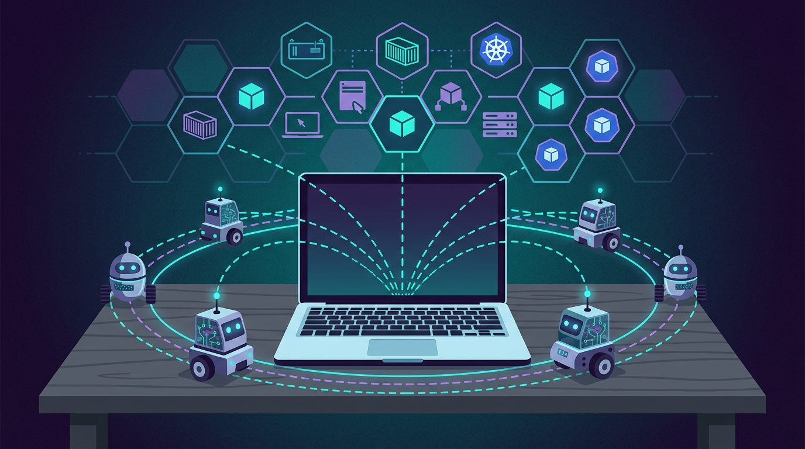

Solo.io anunció **agentdesktop**, un nuevo proyecto open source que lleva la gobernanza que ya tenía implementada para infraestructura agentic hasta el lugar donde de verdad viven los agentes: las máquinas de los desarrolladores, donde corren **Claude Code, Codex** y otros agentes de propósito general.

El argumento de fondo es que la IA agentic abrió una dimensión nueva de exploits de escritorio: más superficie de cobertura y un blast radius mucho mayor. El problema es que la mayoría de las organizaciones cree que sus controles actuales (MDM y firewall) ya cubren todo el perímetro. Los números cuentan otra historia.

Un estudio reciente muestra que **90% de los ejecutivos** aseguran estar confiados de saber qué IA corre en su organización. La realidad es otra: **52% de los empleados** admite usar herramientas de IA que su empresa nunca aprobó (Okta), y **86% de las empresas** no aplica políticas de acceso para identidades de IA (Cloud Security Alliance).

El tradeoff que plantea Solo.io es directo: mientras más autonomía y poder le das a los agentes, menos predecibles y controlables se vuelven. agentdesktop busca cerrar esa brecha llevando los mismos controles que ya existían en el lado de infraestructura (seguridad, observabilidad y ciclo de vida) hasta el endpoint.

Esto se apoya en **kagent**, un proyecto CNCF Sandbox que funciona como runtime Kubernetes-native para que los agentes sean workloads de primera clase, con los controles de seguridad, observabilidad y ciclo de vida que exigen las empresas para correr patrones de asistentes siempre activos.

Es un movimiento lógico: la gobernanza de agentes venía quedándose en el cluster, pero los agentes ya se instalaron en el escritorio. Solo.io apuesta a llevar el control hasta ahí.
