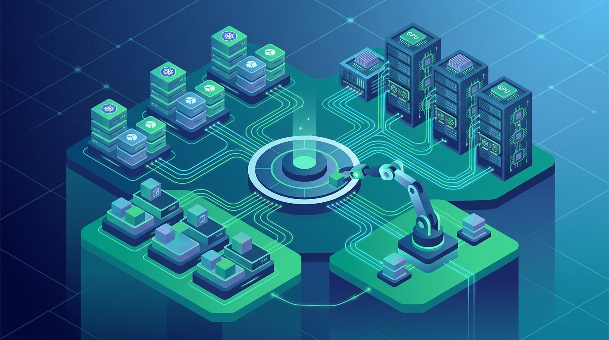

AWS presentó **HyperPod InstantStart**, un control plane open source pensado para pilotar **Amazon SageMaker HyperPod**, su servicio de cómputo managed para entrenar y desplegar modelos de fundación. La jugada: combinar la orquestación de **Amazon EKS** con las capacidades managed de HyperPod, y exponer todo a través de dos fachadas —una web y un agente IA— que ejecutan exactamente las mismas operaciones guardadas.

## Un solo contenedor, tres fachadas

InstantStart corre como un único contenedor de gestión *out-of-band* dentro de la cuenta AWS del cliente. Llama a las APIs de AWS y a la API de Kubernetes, pero **nunca se mete en el camino crítico** de un job de entrenamiento o de una request de inferencia. Esa es la gracia: es gestión, no data path.

Ofrece tres formas de usar el mismo motor:

- **Web UI clásica**, con formularios y barras de progreso.
- **CLI/API REST**.
- **Herramientas MCP** que usa un agente IA: le dices *"Help me create a new HyperPod cluster"* y el agente planifica el flujo multi-paso, lanza cada fase, consulta las operaciones asíncronas de AWS hasta que terminan, y solo se detiene para las decisiones que de verdad le tocan al usuario (zona de disponibilidad, tipo de instancia, tipo de capacidad).

Las tres fachadas llaman a las mismas validaciones y leen el mismo estado de operación persistido. O sea, no hay un "modo agente" que haga las cosas a medias: lo que ve la web es lo mismo que ejecuta el agente.

## Por qué importa el enfoque

AWS lo plantea como un ataque a un dolor concreto del mundo ML infra: levantar un cluster HyperPod es una cadena de tareas dependientes (red, plan de control, dependencias, storage, identidad, jobs distribuidos, model servers), cada una con su propia API, sus modos de falla y sus timeouts. La carga operacional real está en las *transiciones* entre esas etapas.

La apuesta de AWS es encodear las reglas operacionales directamente en una **API de control**, en vez de dejar que un agente manipule un CLI crudo. Así la automatización por agentes es confiable y no se cae en errores de secuenciamiento.

Técnicamente, EKS sigue siendo la superficie de orquestación Kubernetes que maneja el usuario, mientras HyperPod aporta lo managed por AWS en cuatro familias: infraestructura (health checks, revisiones profundas), capacidad, entrenamiento y storage.

## Lo importante para DevOps/Plataforma

Este es un patrón que se va a repetir harto en 2026: **exponer operaciones de infraestructura como API + MCP para que agentes IA las ejecuten de forma determinista**, sin soltarles un shell. InstantStart es el ejemplo más claro desde un hyperscaler de cómo se ve "agent-driven infrastructure" con guardrails de verdad. Si estás armando agentes para operar tu plataforma, el modelo a copiar es este: misma validación, mismo estado, múltiples interfaces.

**Fuentes:** [AWS Machine Learning Blog](https://aws.amazon.com/blogs/machine-learning/run-agent-driven-amazon-sagemaker-hyperpod-operations-with-instantstart/), [Le Fil IA](https://www.lefilia.fr/article/6117438-gestion-des-operations-amazon-sagemaker-hyperpod-par-agents-autonomes-avec-instantstart)
