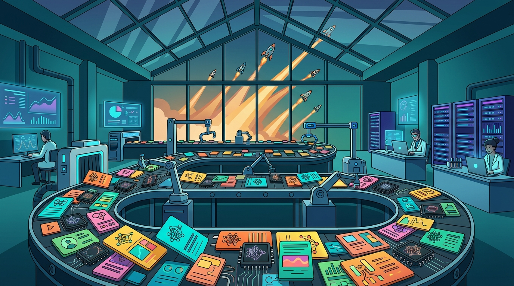

Esta semana la industria de la IA pisó el acelerador a fondo y a alguien se le cayó el nombre justo: **"model fatigue"** (fatiga de modelos). Lo acuñó CNBC para describir lo que veníamos viendo hace meses: los labs ya no compiten por sacar *el* modelo del año, sino por sacar *un* modelo cada par de días.

El recuento de la semana habla solo:

- **Anthropic** actualizó Fable y Mythos.
- **Meta** y **Google** despacharon mejoras de sus modelos.
- **OpenAI** lanzó GPT-6 Astra, el lanzamiento más comentado (y el de rollout más desprolijo).
- **NVIDIA** cerró la compra de **Hugging Face** por US$12.900 millones, metiéndose de lleno en el ecosistema open source.

## El problema no es la velocidad, es la digestión

El punto de CNBC no es que haya muchos modelos —eso ya lo sabíamos—. Es que **la capacidad de adopción se convirtió en el nuevo cuello de botella**. Un equipo de plataforma o datos no alcanza a evaluar, hacer benchmark ni poner en producción un modelo antes de que el proveedor anuncie el siguiente. El resultado es *benchmark chasing* eterno, migraciones a medias y la sensación de que cualquier decisión técnica queda obsoleta en semanas.

## Lo que esto significa para los equipos

- **No persigas cada release:** define tu caso de uso y evalúa modelos contra *eso*, no contra el Hacker News del día.
- **Ojo con los proveedores que prometen "lo último":** que un modelo salga no significa que esté estable ni disponible para todos (el caso Astra lo dejó clarísimo).
- **El costo real es humano:** ciclos de evaluación que se repiten sin terminar valen más caro que la diferencia de benchmark.

La ironía es bonita: llegamos al punto donde el cuello de botella de la IA dejó de ser entrenar modelos, y pasó a ser **entenderlos, probarlos y decidir qué hacer con ellos**.

**Fuentes:** [CNBC](https://www.cnbc.com/2026/09/06/meta-google-openai-anthropic-ai-model-fatigue.html), [UA.NEWS](https://ua.news/en/technologies/ai-kompaniyi-priskorili-onovlennia-modelei-na-tli-konkurentsiyi).
