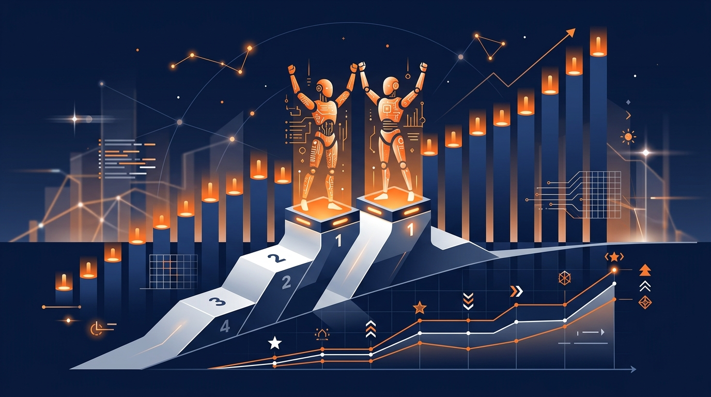

Artificial Analysis volvió a mover las piezas de su Intelligence Index y, de paso, le cambió la foto al tablero de liderazgo. La versión **v4.3** llega apenas días después de la v4.2, en lo que la consultora describe como la continuidad del despliegue de su Intelligence Index v5.

## Qué cambió

Dos movimientos grandes en la metodología:

- **Terminal-Bench se actualiza a v4.0** (reemplaza a la versión v2.1 que venía corriendo).
- Se estrena **AutomationBench-AA**, un benchmark de automatización de flujos de trabajo agénticos con set de prueba privado, que reemplaza al antiguo τ³-Banking. Lo corren en colaboración con Zapier sobre un set de **657 tareas** (la versión v1.0.6 del benchmark).

## El nuevo ranking

Con la v4.3, **Fable 5.1 y GPT-6 Astra quedan empatados en el primer lugar**. Y ojo, porque ahí se cuela una señal interesante: Fable, un lab relativamente más chico, compite cabeza a cabeza con el buque insignia de OpenAI.

En el frente de modelos abiertos (open weights), la cosa sigue dominada por los chinos:

- **GLM-5.3 y Kimi K3 lideran con 44**.
- GLM-5.3-Flash: 42.
- Qwen3.8 2.4T A95B: 40.
- DeepSeek V4 Pro 0813 (max): 36.

## Por qué importa

Que una actualización de metodología reordene el top es un recordatorio de que los benchmarks no son verdades absolutas: son **medidas móviles** que dependen de qué tareas pesan más en la balanza. El agregado de AutomationBench-AA también empuja la evaluación hacia tareas de **automatización real de flujos**, más cercanas a lo que los agentes harán en producción que a resolver puzzles de razonamiento.

La moraleja para el que elige modelo: no se case con un número, mire **qué mide** el índice y si eso se parece a su caso de uso.
