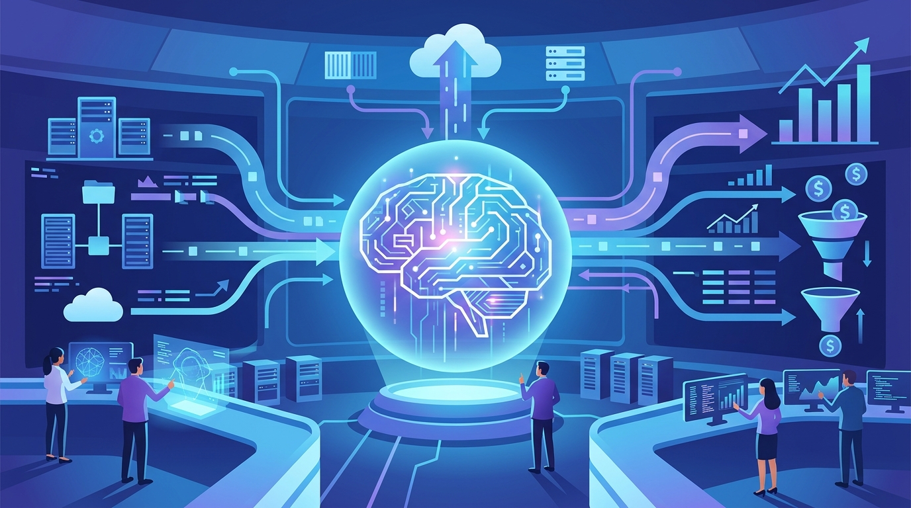

La consultora europea **Devoteam** anunció una alianza estratégica con **Dynatrace** para empujar observabilidad impulsada por IA en todo el bloque EMEA. La jugada junta la plataforma de Dynatrace con la consultoría hands-on de Devoteam, que ya venía implementando Dynatrace en clientes grandes del sector bancario, utilities y retail de lujo.

La idea central es mover a las empresas de un monitoreo técnico clásico a una **observabilidad proactiva alineada al negocio**. Para eso, Devoteam integra el stack completo de Dynatrace: el motor de IA **Davis**, la instrumentación automática de **OneAgent**, el mapeo de topología **Smartscape** y el lakehouse de datos **Grail**.

## Qué gana el cliente final

La propuesta de valor se resume en cuatro frentes concretos:

- **Visibilidad de negocio y UX de punta a punta**: conectar la salud técnica de los sistemas con transacciones, ingresos y métricas de conversión.
- **Reducción de incidentes y riesgos**: el análisis de causa raíz automatizado de Davis AI baja el MTTR y permite auto-remediación antes de que el problema golpee al usuario.
- **Costo y sostenibilidad en la nube**: análisis de infraestructura en tiempo real para optimizar consumo y medir la huella de carbono vía **Dynatrace Carbon Impact**.
- **Time-to-market más rápido**: integración nativa con pipelines de DevOps y CI/CD.

## El timing no es casual

La alianza llega en un momento en que Dynatrace viene moviendo fuerte en el espacio de IA: hace poco cerró la compra de **Arize** por 915 millones para meter evaluación de modelos y agentes bajo su techo. Sumarle un socio de servicios como Devoteam le da cancha para aterrizar ese stack en los clientes enterprise de Europa.

"La experiencia de consultoría de Devoteam y su historial en empresas complejas de Europa los convierten en una adición valiosa a nuestro ecosistema de partners", señaló **Luís Porém**, VP de EMEA Partners en Dynatrace.

En resumen: menos monitoreo por monitorear, más observabilidad que responde una pregunta de negocio.

**Fuente:** [Devoteam](https://www.devoteam.com/news-and-pr/devoteam-partners-with-dynatrace/).
