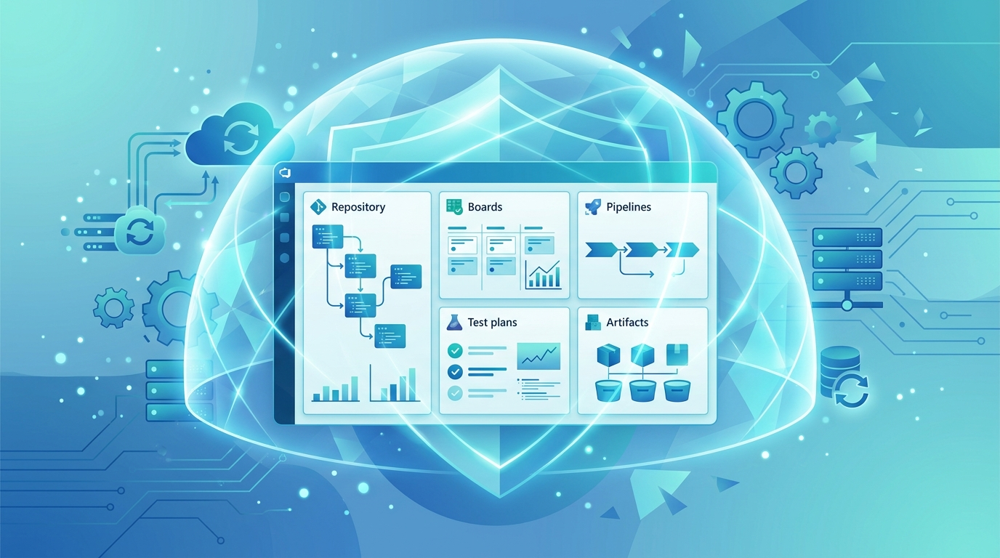

HYCU —que se autodefine como "la #1 en AI Resilience"— anunció la **disponibilidad general de HYCU R-Cloud para Azure DevOps**, una solución de protección de datos y recuperación granular pensada para la plataforma que usan más de **30.000 organizaciones** para sacar software a producción.

El pitch es directo: proteger Azure DevOps no es solo respaldar los repos. El riesgo real está en las **definiciones de pipeline, las plantillas de proceso y los work items**, que arrastran requisitos, decisiones e historial de revisiones construido durante años y que vive únicamente dentro del servicio.

## Por qué la herramienta nativa no alcanza

HYCU apunta justo al hueco que dejan las opciones de recuperación de Microsoft:

- Organizaciones y proyectos eliminados: recuperables solo **28 días**.
- Repositorios: **30 días**.
- Test plans y suites: apenas **14 días**.

Y lo más delicado: los assets borrados con el parámetro **destroy** se saltan la papelera por completo y no se pueden recuperar. Microsoft incluso recomienda en su propia documentación factorizar esta limitación en la estrategia de protección.

## El problema estructural de Azure DevOps

La plataforma se compone de **cinco servicios distintos** —Repos, Boards, Pipelines, Test Plans y Artifacts— cada uno con su propio modelo de datos. Eso implica que no existe un export ni un script único capaz de producir una copia utilizable de un proyecto completo:

- Las **definiciones de pipeline** dependen de variable groups, service connections y agent queues guardados en un scope separado.
- Las **plantillas de proceso** y los work items personalizados tampoco viven donde uno espera.

"Si te pierdes cualquiera de esas piezas, puedes restaurar todos los archivos y aun así entregarle al equipo un proyecto donde no pueden trabajar", resumió **Anant Chintamaneni**, Chief Product Officer de HYCU.

La integración ya está disponible en el **HYCU Marketplace**.

**Fuente:** [HYCU (GlobeNewswire)](https://www.globenewswire.com/news-release/2026/09/08/3357651/0/en/hycu-brings-enterprise-class-data-protection-to-azure-devops-with-general-availability-of-hycu-r-cloud-for-azure-devops.html).
