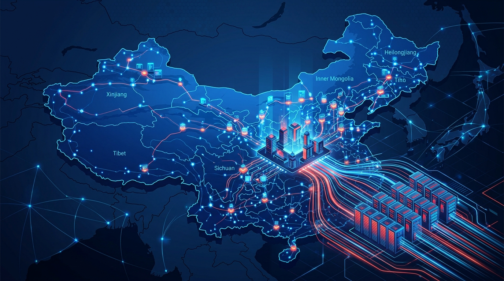

La CNCF y SlashData publicaron el **State of Cloud Native Development in China**, un informe que le pone números al momento cloud native del gigante asiático y, de paso, confirma una tendencia que ya se sentía en el aire: **la IA está migrando del entrenamiento a la inferencia en producción**.

## Los números que importan

- China concentra unos **1,75 millones de desarrolladores cloud native**, de los cuales **400.000 son desarrolladores de IA**.
- El **48% de los desarrolladores backend** chinos ya son cloud native, frente al 30% de hace dos años. La media global es 52%, así que China prácticamente alcanzó la línea base mundial.
- Entre los backend **menores de 25 años**, el **58%** es cloud native: la nueva generación construye directamente sobre Kubernetes.
- El ecosistema cloud native global ya llega a **19,9 millones de desarrolladores** y sigue creciendo.

## El camino de la IA hacia producción

El informe mapea cómo los equipos de IA van adoptando infraestructura a medida que maduran, y el recorrido es reconocible para cualquiera que haya operado sistemas distribuidos:

1. **Pipelines de datos**: Kubernetes y microservicios como base, luego arquitectura event-driven, streaming y observabilidad.
2. **Entrenamiento y experimentación**: feature flagging, RPC e infraestructura inmutable para versionar modelos, entrenamiento distribuido y entornos reproducibles.
3. **Serving en producción**: service mesh, chaos engineering y gestión multi-cluster para split de tráfico, pruebas de resiliencia e inferencia distribuida.

Chris Aniszczyk, CTO de la CNCF, lo resumió con una idea potente: **a medida que la inferencia escala, los desafíos se parecen mucho a los clásicos de cloud native** —scheduling, aislamiento, networking, observabilidad y operar sistemas distribuidos de forma confiable.

## Un patrón que se repite

No es casualidad que el informe salga en la KubeCon China, el mismo evento donde **Karmada se graduó** y **China Merchants Bank** ganó el caso de estudio por unificar entrenamiento e inferencia sobre Kubernetes. La historia se está escribiendo en tiempo real: China no solo adopta cloud native, sino que lo está usando como el riel sobre el que corre su apuesta de IA. Y el destino de esa apuesta ya no es el laboratorio, sino **servir modelos a escala**.
