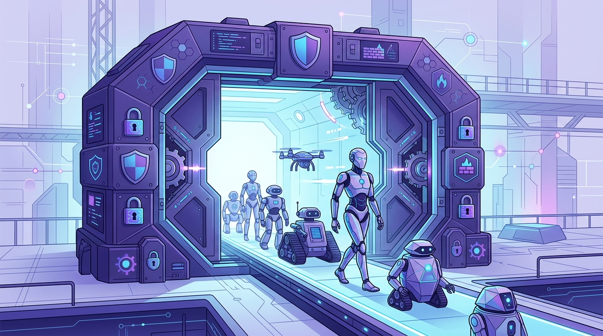

Después de nueve años al mando de HashiCorp, Dave McJannet se cambió de trinchera. Su nueva obsesión, según contó a The New Stack, es **"desbloquear" los agentes de IA en la empresa**. Y para eso armó **Dome**.

## El problema que Dome ataca

La tesis es simple y le pega directo al dolor real del mundo enterprise: los equipos de desarrollo pueden construir un agente de IA sin problema, pero **se estrellan contra el muro de la revisión de seguridad y operaciones** cuando un cliente grande empieza a hacer su due diligence.

McJannet lo sabe mejor que nadie. HashiCorp se hizo gigante justamente vendiendo las llaves de la infraestructura (Terraform, Vault) que las empresas necesitan para operar con confianza. Ahora el cuello de botella cambió: ya no es provisionar infra, sino **gobernar agentes autónomos**.

## A quién le habla

El usuario objetivo de Dome son los **equipos de platform engineering** dentro de empresas grandes, esos que trabajan codo a codo con operaciones y seguridad. Pero hay una segunda puerta: el self-serve que le abre espacio al **unicornio unipersonal** —la empresa de una o dos personas que construye un agente y quiere vendérselo a una corporación.

Ese escenario, dice McJannet, es donde más se nota la fricción: puedes llegar lejos construyendo la aplicación, pero el trámite de seguridad y operaciones del cliente corporativo te frena en seco.

## Por qué importa

Si 2025 fue el año de "poner un agente en producción", 2026 se perfila como el año de **hacer que esos agentes sean gobernables y auditables**. Dome se mete justo en la intersección entre DevOps, seguridad y plataformas de agentes. Habrá que ver si McJannet logra repetir el truco que le funcionó en HashiCorp: convertir un dolor de infraestructura en una categoría de producto.
