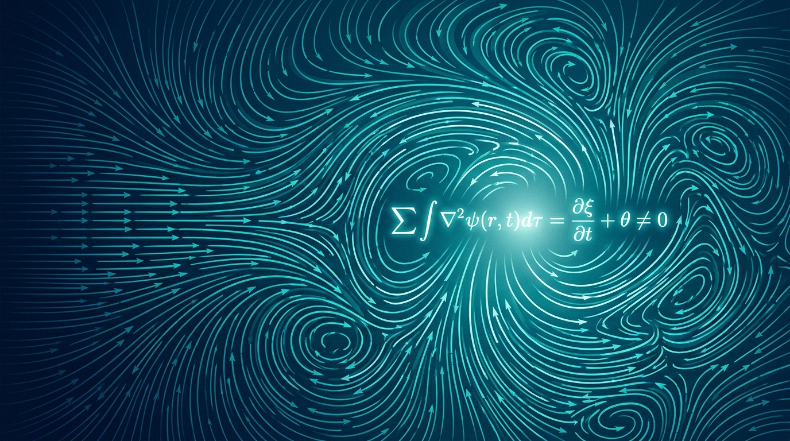

OpenAI soltó una bomba el lunes: dice que su modelo interno demostró que las ecuaciones de Navier-Stokes —esas que describen cómo se mueven los fluidos y que llevan casi 200 años desafiando a los matemáticos— son "fatalmente defectuosas". Es, literalmente, uno de los Problemas del Milenio de Clay, con un millón de dólares de premio encima. Y como toda buena bomba, viene con una nube de polvo detrás.

## Cómo lo hicieron

Según contó Sebastien Bubeck en una conferencia de prensa, OpenAI empezó a entrenar un modelo nuevo con capacidades matemáticas avanzadas el 28 de agosto. Cuando corrieron rumores de que Anthropic andaba avanzando en el mismo problema, decidieron meterle más recursos. Pusieron a **más de 1.000 agentes** a atacar el problema durante **más de 50 horas** hasta que apareció la solución.

"Pensé que tenía que haber un error en alguna parte", dijo Bubeck. "Y el domingo por la mañana teníamos la solución final, formalizada en Lean y todo". Lean es el lenguaje de programación que se usa para formalizar demostraciones matemáticas. Mark Chen, jefe de investigación, aclaró que el costo en cómputo fue de **millones de dólares**.

## La polémica

Acá es donde se pone feo. Tristan Buckmaster (matemático de NYU) y Levent Alpöge (investigador de Anthropic) habían publicado el lunes documentos reclamando avances clave en un área relacionada con Navier-Stokes, usando varios modelos de IA, incluidos Claude y Codex.

Buckmaster publicó una declaración asegurando que, la semana pasada, OpenAI se enteró de su trabajo y **empezó a acelerar para ganarles la carrera**. La acusación es grave: OpenAI habría corrido después de saber lo que ellos estaban haciendo y, encima, habría intentado influir en quién se lleva el crédito.

OpenAI respondió que ni sus investigadores ni sus agentes vieron el trabajo de Buckmaster y Alpöge antes de que la pareja lo publicara públicamente, y que venían persiguiendo líneas de investigación relacionadas desde antes.

## Por qué importa

Más allá del drama de créditos, es la primera vez que una IA reivindica una solución a un problema del calibre del Millennium Prize. Si se verifica, sería un hito monumental para la matemática asistida por IA. Si la polémica de Buckmaster tiene fundamento, queda la sombra de que el "descubrimiento" fue más una carrera táctica que una genialidad espontánea. Por ahora, matemáticos externos no pueden auditar la demostración porque OpenAI no la ha liberado completa. El veredicto, como en las buenas teleseries, queda pendiente.
