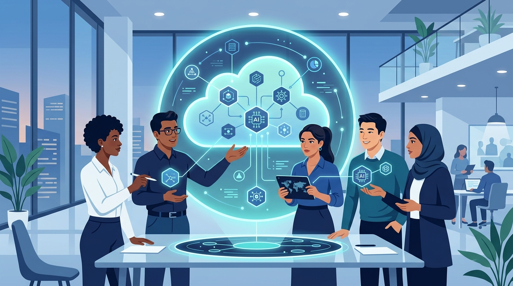

La guerra por la "implementación de IA" —no por los modelos, sino por instalarlos de verdad en empresas— sumó un nuevo frente. Google Cloud y Accenture anunciaron la creación del **Accenture Gemini Enterprise Business Group**, una unidad global pensada para ayudar a los clientes a escalar resultados con Gemini en la era de la IA agéntica.

El dato duro: el grupo va anclado a una fuerza de hasta **1.000 "forward-deployed engineers" (FDE)**, ingenieros que trabajan en el sitio del cliente, codo a codo, para destrabar adopción. No es un concepto nuevo, pero sí la apuesta más explícita de Google Cloud por ese modelo de negocio.

## El contexto que importa

Google Cloud facturó **USD 24.800 millones** en el segundo trimestre, buena parte impulsada por IA empresarial. Pero el costo de sostener eso es gigante: Alphabet habría acumulado **USD 811.000 millones** en compromisos de compra y obligaciones contractuales al 30 de junio, según WSJ.

Traducción: los hyperscalers están metiendo cientos de miles de millones de dólares en GPUs, data centers y energía, mientras el retorno atribuible a IA sigue siendo una fracción de esa inversión. Por eso todo el mundo está corriendo a la misma jugada: convertir la "implementación" en un negocio propio.

## No están solos en la cancha

OpenAI, Anthropic, Microsoft y Amazon ya lanzaron unidades parecidas en 2026, todas apostando a que instalar modelos de IA puede convertirse en un negocio de un billón de dólares. Microsoft puso **USD 2.500 millones** en su propia empresa de despliegue de IA; Amazon lanzó su org de FDE con **USD 1.000 millones**.

Accenture suma casi **50.000 profesionales** con skills de Google Cloud, y la nueva unidad se apoya en esa base más los certificados en Gemini Enterprise. La tesis: la demanda de IA no está garantizada, porque las propias empresas están peleando por ver un retorno real de su gasto en IA. El que logre "que funcione en producción" se lleva el mercado.
