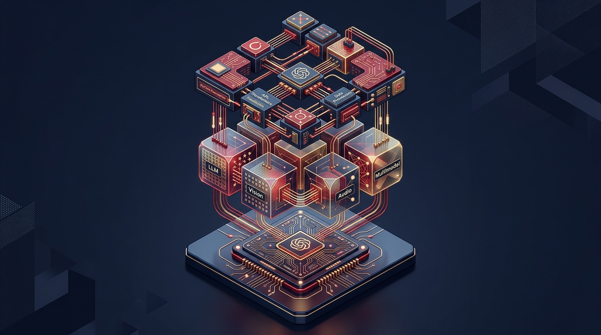

La **PyTorch Foundation** (bajo el alero de la Linux Foundation) anunció en Shanghái que **Alibaba Cloud** y **Cambricon** se suman como miembros **Platinum**, mientras que **Ant Group** entra como miembro **Gold**. El anuncio cayó en el marco del primer **KubeCon + CloudNativeCon + OpenInfra Summit + PyTorch Conference China 2026**, y deja una señal clara: los pesos pesados chinos ya no solo consumen PyTorch, también quieren sentarse a la mesa donde se decide su rumbo.

## Quién trae qué

Las charlas clave del evento dibujan un stack completo, de abajo hacia arriba:

- **Alibaba Cloud (Platinum):** el equipo de infraestructura de Qwen abre el arco a nivel plataforma, mostrando cómo sirven **Qwen a escala masiva**. No es un detalle menor: Qwen es el modelo abierto más descargado del ecosistema, así que Alibaba está literalmente enseñando a operar inferencia de peso abierto en producción.
- **Cambricon (Platinum):** entra por la capa del **chip**. Es el fabricante chino de aceleradores de IA, y su tema es cómo esos aceleradores se integran al stack de software abierto.
- **Huawei** (presente en los keynotes, aunque no anunciado como miembro): plantea el **co-diseño hardware-software** y la interoperabilidad entre los stacks chinos y los globales. La pregunta de fondo: qué pasa cuando más aceleradores distintos entran a producción.
- **Ant Group (Gold):** va a la capa de aplicación, mostrando cómo piezas cloud native ya existentes —**Kubernetes Agent Sandbox** y **Kata Containers**— se ensamblan en un runtime seguro y on-demand para **agentes de IA**.

## Por qué importa

Esto no es solo un anuncio de membresías. Es China institucionalizando su apuesta por el open source de IA en el marco que hoy domina el entrenamiento de modelos a nivel mundial. El arco completo que describen los keynotes va de **silicio a software a despliegue**, y deja ver la estrategia: no competir solo con modelos, sino con **un stack abierto de punta a punta** que no dependa del ecosistema Nvidia/CUDA.

Para el que sigue la tesis del post de Nvidia comprando Hugging Face, esto es la contra-cara: mientras Nvidia asegura que el open source siga corriendo en su hardware, China está construyendo la alternativa —chips propios, modelos abiertos y un runtime cloud native— para que el ecosistema no tenga un solo dueño.

La lectura práctica para equipos de infraestructura: PyTorch como estándar de facto se refuerza todavía más, y los aceleradores chinos (Cambricon, Ascend de Huawei) vienen empujando fuerte para entrar a los pipelines de inferencia. No es para reaccionar mañana, pero sí para tenerlo en el radar de los próximos 12 meses.

Fuentes: [PyTorch Foundation vía PR Newswire](https://www.prnewswire.com/news-releases/alibaba-cloud-ant-group-cambricon-and-huawei-come-together-in-shanghai-to-advance-the-open-source-ai-stack-at-pytorch-conference-china-302870308.html) (08-09-2026).
