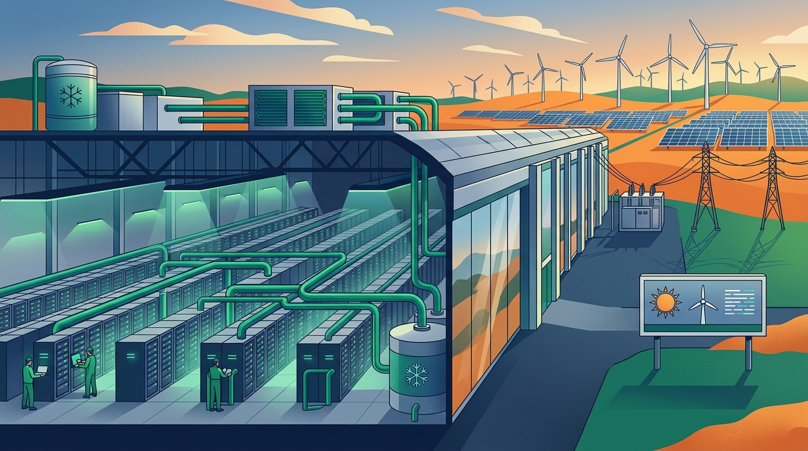

NVIDIA arrancó la semana con un anuncio de infraestructura grande: se asocia con **ocho empresas del ecosistema de data centers australiano** para levantar lo que llama "AI factories" sobre su plataforma **DSX**, con una meta de hasta **2 gigavatios de capacidad para 2027**. Según Reuters, eso **más que duplica** la carga de cómputo actual del país.

## Los socios y el plan

Los nombres de la alianza son los pesos pesados locales: **Firmus, Sharon AI, IREN, ResetData, Megaport, CDC, NEXTDC y AirTrunk**. Cada uno aporta tierra, energía y "shell" (el cascarón de infraestructura física), mientras NVIDIA pone la plataforma DSX —cómputo acelerado, networking, software y soporte— compatible con el ecosistema CUDA y mejorable por software a lo largo de su vida útil.

Algunas cifras que importan para el que sigue el tema infra:

- **Sharon AI** planea desplegar hasta **68.000 GPUs NVIDIA**, interconectadas con Quantum InfiniBand y Spectrum-X Ethernet.
- **IREN** aporta su campus Bundey de **800 megavatios** en Australia del Sur, con una plantilla repetible para escalar capacidad.
- **CDC** ya opera **550 MW** entre Australia y Nueva Zelanda (con otros 800 MW en construcción), usando energía 100% renovable y enfriamiento zero-water.
- **Megaport**, vía su filial Latitude.sh, apunta al cómputo de inferencia más cerca del usuario para bajar latencia.

## La jugada no es solo fierros

El punto de fondo lo resume Raj Mirpuri (VP de AI clouds e infraestructura en NVIDIA): *"las AI factories convierten energía en inteligencia — el recurso esencial de la economía de la IA"*. La tesis es que DSX hace que estas fábricas sean "fungibles, durables y una nueva clase de activo invertible".

Y para que el cómputo no quede huérfano, el anuncio cierra el círculo con **modelos abiertos Nemotron**: empresas como **Heidi** (salud) y **Atlassian** (para su búsqueda semántica Rovo) ya los están usando para construir y ajustar modelos locales.

Para el lector de infra: es la señal más clara de que la batalla por la capacidad de cómputo se está jugando a nivel país, con los gigantes firmando acuerdos soberanos para asegurar energía, tierra y refrigeración antes que chips. Australia se suma a la lista.

Fuentes: [NVIDIA Newsroom](https://www.globenewswire.com/news-release/2026/09/10/3359139/0/en/nvidia-expands-ai-infrastructure-capacity-in-partnership-with-australia-s-data-center-ecosystem.html), [Reuters](https://www.freedom969.com/business/nvidia-plans-major-expansion-of-data-centre-capacity-in-australia-to-meet-ai-demand), [Yahoo Finance](https://finance.yahoo.com/technology/ai/articles/nvidia-partners-8-australian-firms-122438874.html).
