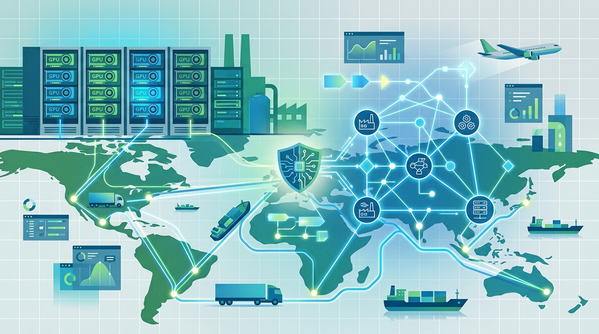

Este **10 de septiembre** NVIDIA y Palantir anunciaron una colaboración para llevar **IA soberana a cadenas de suministro críticas**, y el primer cliente es nada menos que NVIDIA misma. La jugada mete los **modelos abiertos Nemotron** dentro de **Palantir Foundry** y **AIP**, todo anclado en la **Ontology** de Palantir para que la organización mantenga el control y la propiedad de sus datos.

## De "wafer-out" a "first token"

NVIDIA describe su supply chain como una de las más complejas del mundo: **1,3 millones de piezas por rack** Vera Rubin, miles de proveedores y una red global de fábricas. El equipo midió el rendimiento en dos relojes: **time-to-rack** (del silicio saliendo de la fábrica al sistema ensamblado) y **time-to-token** (energía, refrigeración, networking y software que hacen productiva la infra).

Cada semana hay que decidir cuánto material se asigna a cada planta de manufactura —un problema de asignación que los planificadores humanos rehacían a mano. La solución: un **Digital Supply Chain Intelligence command center** sobre Foundry, donde la Ontology conecta materiales, plantas, commits, capacidad, asignaciones y señales cualitativas en una sola capa de datos gobernada. Arriba corre **cuOpt** (optimización con GPU de NVIDIA) resolviendo la asignación como un programa lineal entero mixto.

## El modelo que aprendió de los planificadores

El detalle técnico más jugoso está en el [post del NVIDIA Technical Blog](https://developer.nvidia.com/blog/from-wafer-out-to-first-token-codifying-supply-chain-expertise-with-nemotron-and-palantir-foundry/): hicieron **post-training del modelo abierto Nemotron 3.5 Lightning** (30B de parámetros, ~3B activos por forward pass) sobre las decisiones históricas de los planificadores, usando LoRA en dos GPUs B200.

¿Por qué no bastaba el solver? Porque los humanos le ganaban usando información que el modelo no veía: correos con socios, pronósticos de clima severo, eventos geopolíticos y años de experiencia acumulada. El resultado del fine-tuning:

- **86,7%** de precisión en decisiones de asignación el modelo post-entrenado.
- **55,5%** el Nemotron 3 Ultra (más grande) y **17,5%** el Lightning base.

Los números crudos son honestos: las ganancias se concentran en el dominio entrenado, y la predicción de riesgos futuros sigue siendo difícil. Las recomendaciones aceptadas o corregidas se escriben de vuelta en la Ontology para futuros entrenamientos —el modelo nunca se reentrena solo en producción.

## Dónde corre y hacia dónde va

El stack corre sobre arquitecturas de referencia de NVIDIA y la **Palantir Sovereign AI Operating System Reference Architecture (SAIOS)**, con soporte de **Dell** y **Cisco**; se puede desplegar on-premise o en colo/cloud con **Rackspace** y **Nebius**.

Alex Karp (Palantir) lo resumió con su estilo habitual: *"nuestro stack soberano, con Nemotron y Ontology, está entregando capacidades que superan la frontera"*. Jensen Huang, más sobrio: *"las cadenas de suministro son el sistema operativo de la economía física"*. El plan es extender lo aprendido a manufactura, energía, salud, automotriz y aeroespacial, con debut público en la conferencia AIPCon 11.

Fuentes: [NVIDIA Newsroom](https://nvidianews.nvidia.com/news/nvidia-and-palantir-bring-sovereign-intelligence-to-critical-supply-chains), [NVIDIA Technical Blog](https://developer.nvidia.com/blog/from-wafer-out-to-first-token-codifying-supply-chain-expertise-with-nemotron-and-palantir-foundry/), [Securities.io](https://www.securities.io/nvidia-and-palantir-deploy-sovereign-ai-stack-for-supply-chains/).
