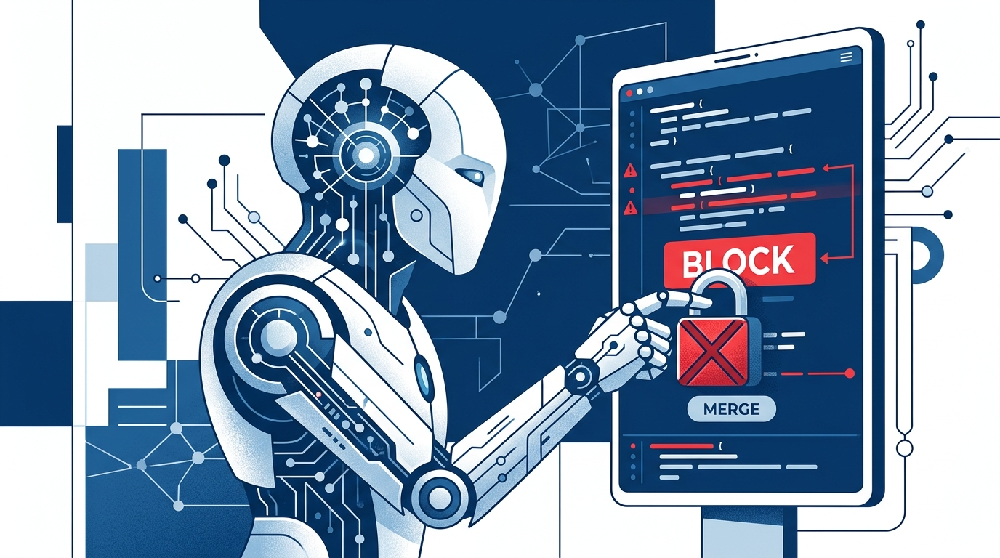

OpenAI acaba de cruzar una línea que en DevOps se venía discutiendo hace rato: **le dio a un modelo de IA poder de veto sobre el código que escriben sus propios ingenieros**. Según reporta [The New Stack](https://thenewstack.io/openai-ai-code-review/), **cada pull request** que envía un ingeniero de OpenAI pasa por una revisión de seguridad automatizada, y el modelo que revisa **puede frenar el merge** si detecta una vulnerabilidad.

## El "revisor con dientes"

No es la típica integración de linter que solo comenta y deja pasar. Acá la IA no solo sugiere: **tiene autoridad para bloquear**. Si encuentra un problema de seguridad, el código no se fusiona. Es un cambio de fondo respecto al modelo "el humano decide al final" que dominaba hasta ahora en la mayoría de los equipos.

La movida viene en paralelo con la expansión de la herramienta de review de código de OpenAI (Codex), que ya documenta en [ChatGPT Learn](https://learn.chatgpt.com/docs/third-party/github) cómo configurar **Code Review y Security Review** para PRs de GitHub: pedir reviews con `@codex review` y `@codex security review`, habilitar revisiones automáticas y escribir reglas propias en un `AGENTS.md`.

## Qué significa para el resto

Esto es OpenAI dogfooding su propio agente de seguridad, y el mensaje es claro: **confían en la IA lo suficiente como para darle la llave del merge**. Para los equipos de plataforma, plantea la pregunta incómoda —¿estás listo para que una IA rechace el código de tus devs sin intervención humana?

El lado positivo: las revisiones de seguridad no escalan con humanos, y una IA que bloquea en frío puede frenar una vulnerabilidad antes de que llegue a producción. El lado de riesgo: falsos positivos bloqueando deploys, y la pregunta de siempre —¿quién audita al auditor? Por ahora, OpenAI responde con hechos: la IA ya está en producción revisando a sus propios creadores.

Fuentes: [The New Stack](https://thenewstack.io/openai-ai-code-review/), [ChatGPT Learn](https://learn.chatgpt.com/docs/third-party/github).
