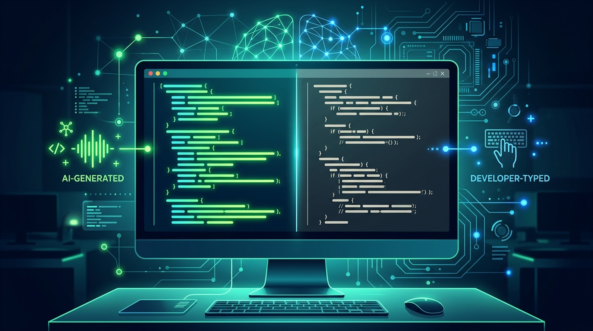

La IA ya no es una curiosidad en el editor de texto: es parte del commit. La encuesta **State of Code 2026 de Sonar** (sobre 1.149 desarrolladores) calcula que **el 42% del código que se commitea ya es generado o asistido por IA**, y los propios encuestados proyectan que esa cifra llegará al **65% en 2027**.

## Adopción masiva y cotidiana

Los números de uso dejan claro que la herramienta dejó de ser opcional:

- **72%** de los desarrolladores que probaron herramientas de IA para codificar las usan **todos los días**.
- Por herramienta: **Copilot 75%, ChatGPT 74%, Claude 48%, Gemini 31%, Cursor 21%**.

No es un nicho de early adopters. Es la práctica por defecto de la mayoría.

## La parte que debería preocupar a plataformas

El titular optimista esconde el riesgo que Sonar —que justamente vende análisis de código— se encarga de subrayar: **velocidad sin control**. El estudio insiste en el equilibrio entre rapidez y seguridad, porque más código generado significa más superficie para bugs, deuda técnica y vulnerabilidades que nadie revisó con calma.

Ahí está el punto para equipos de plataforma y DevOps: si casi la mitad del código ya no la escribe una persona con contexto, los controles de calidad no pueden seguir siendo manuales. El linter, el SAST, la revisión de dependencias y las puertas de CI/CD pasan de ser "buenas prácticas" a ser el único dique real.

La métrica del 42% no es un dato curioso de marketing: es una señal de que el cuello de botella del desarrollo ya no es escribir, sino **verificar**. Y eso, para cualquiera que opere infraestructura o pipelines, es exactamente donde hay que poner el foco.

Fuentes: [DevOps.com](https://devops.com/test-creation-was-never-the-bottleneck/), [GlobeNewswire (Sonar/Carahsoft)](https://www.globenewswire.com/news-release/2026/09/09/3358938/0/en/carahsoft-and-sonar-expand-partnership-to-deliver-ai-code-verification-and-governance-across-all-north-american-markets.html), [Sonar](https://www.sonarsource.com/).
