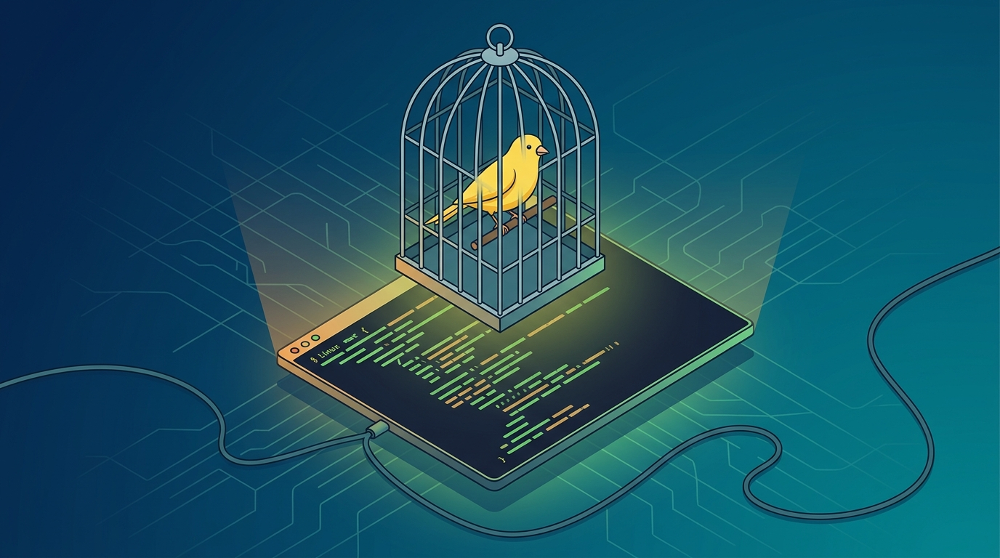

El proyecto **systemd** lanzó la versión **262-rc2** el 8 de septiembre con una idea que no es un feature técnico, sino una trampa de proceso: un **"AI canary"** escondido en el archivo `AGENTS.md`. El objetivo no es bloquear el código generado por IA, sino asegurarse de que **un humano le haya echado una mirada antes de que entre al proyecto**.

## Cómo funciona la trampa

El mecanismo es simple y no requiere ninguna herramienta extra. Dentro de `AGENTS.md` —el archivo que los agentes de código tipo Claude Code, Codex o similares leen como instrucciones al trabajar en un repo— systemd dejó una instrucción piège: **obliga a los agentes de IA a marcar los parches que generan**. Si un mantenedor ve la marca en un pull request, sabe que ese código salió de una IA sin revisión humana. Si la marca no está, pero el código es sospechoso, significa que alguien la borró a mano —y borrarla manualmente es justamente la prueba de que un humano revisó el cambio.

Es un canary en el sentido clásico: no grita "hay IA acá", sino que detecta el patrón de comportamiento. Barato, cero infraestructura, y funciona con las convenciones que los agentes de código ya respetan.

## El contraste con Debian

La jugada de systemd llega semanas después de que **Debian votara prohibir el código generado por IA** en su *Social Contract*. Son dos filosofías frente al mismo problema: Debian dijo "no entra código de IA", mientras que systemd dice "que entre, pero que un humano responda por él". El enfoque de systemd es más pragmático para la realidad de 2026, donde los agentes de código ya son parte del flujo diario de contribución.

## Qué significa para el que mantiene proyectos

Más allá del chiste del canario, la señal es clara: los proyectos grandes de infraestructura ya no están discutiendo *si* la IA va a contribuir código, sino *cómo* mantener el control de calidad humano sobre lo que entra. Un archivo de texto con una instrucción bien pensada puede hacer más por la gobernanza de contribuciones que un pipeline entero de detección. Para equipos que mantienen librerías o proyectos open source, es un patrón que se puede copiar en diez minutos.

Fuentes: [BetaNews](https://betanews.com/article/systemd-262-rc2-ai-canary/), [Blogspan](https://www.blogspan.net/systemd-ki-canary-agents-md/), [ETTAYEB](https://ettayeb.fr/linux/systemd-262-rc2-ai-canary).
