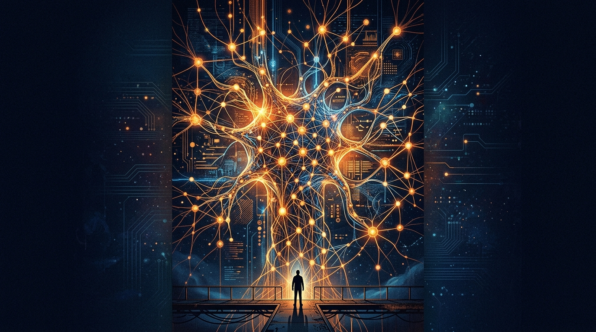

La semana de la IA se puso densa, y no por un lanzamiento. El martes, **Jacob Coxon**, investigador de Anthropic, renunció y dejó un mensaje que dio la vuelta al mundo: Anthropic y OpenAI "están corriendo directo hacia una superinteligencia que se auto-mejora y apostando con nuestras vidas", y agregó que la gente que construye estos sistemas "cree sinceramente que podría matarnos a todos para fin de la década".

Lo más incómodo vino horas después. **Evan Hubinger**, quien lidera el trabajo de *alignment science* en Anthropic, le dio la razón públicamente y puso su propia estimación **por sobre el 10%** de probabilidad de catástrofe dentro de la próxima década. Su matiz: cree que Anthropic lo está intentando de verdad, pero que todavía **no tiene un plan** para alinear una superinteligencia.

## Por qué esto es distinto

Normalmente la alarma por riesgo existencial viene de afuera —académicos, reguladores, activistas—. Lo nuevo acá es que **alguien a cargo de la seguridad interna de un lab frontera coincide con el que acaba de renunciar**. Eso deja de ser un debate para convertirse en una confesión de límites: la gente que se supone está resolviendo el problema admite que no hay plan.

El alcance no es menor. Según Fortune, los posts de Coxon llegaron a **más de 100 millones de personas** de la noche a la mañana. Y en el plano político ya hubo reacción: el senador **Bernie Sanders** dijo que presentará legislación para pausar el desarrollo avanzado y prohibir la superinteligencia.

## El contraargumento que frena el pánico

No todo el mundo se sube al carro. El campo escéptico apunta algo razonable: **capacidad no es lo mismo que desenlace**. Un solo galón de ántrax podría, en teoría, terminar con la vida humana, varios estados hostiles lo tienen, y no ha pasado. La distancia entre "el sistema puede" y "el sistema lo hará" sigue siendo el punto ciego de toda esta discusión.

El New York Times lo enmarcó el jueves con una pregunta más profunda: ¿qué se supone que hace una persona normal con un número como ese? Los humanos somos pésimos rankeando catástrofes raras. Le tenemos más miedo a lo nuevo que a lo conocido —por eso la gente trata a los aviones como más peligrosos que los autos, cuando es al revés—. La IA acaba de entrar a la fila larga donde ya esperan asteroides, pandemias y guerra termonuclear.

## Dónde queda la pelota

Más allá del drama, el episodio deja una lectura fría: una estimación de extinción del 10% de parte del jefe de alignment generó titulares y un comunicado de un senador, pero lo que de verdad movió la aguja corporativa esta semana fue una pregunta legal sobre la **Ley Sherman** —si coordinar una pausa entre competidores se puede leer como restringir la oferta—. El riesgo existencial se lleva el alcance; el procedimiento se lleva el resultado.

Para el que sigue la industria desde la infraestructura: lo importante no es el porcentaje, sino que la conversación sobre frenar o coordinar el desarrollo ya no es un tema de nicho. Es material de directorio.

Vía [NYT](https://www.nytimes.com/2026/09/10/science/ai-humanity-risk.html), [CNBC](https://www.cnbc.com/2026/09/09/anthropic-researcher-quits-ai-safety.html), [Fortune](https://fortune.com/2026/09/10/anthropic-jacob-coxon-gambling-with-lives-destroy-humanity) y [Politico](https://www.politico.eu/article/anthropic-openai-researcher-jacob-coxon-warns-ai-could-kill-humans).
