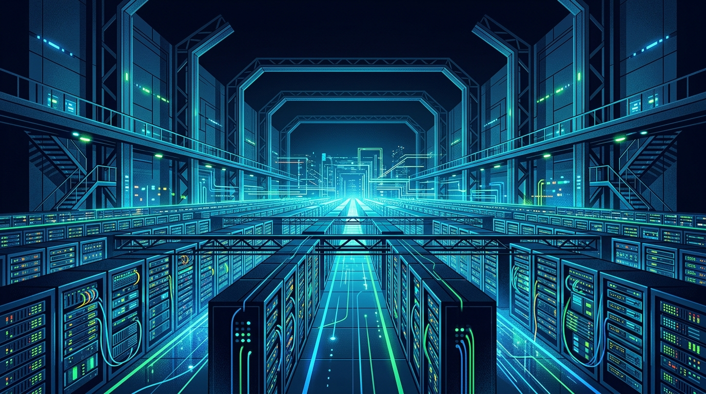

La apuesta por la IA está dejando números de infraestructura que marean. Según un reporte de **Bloomberg**, Microsoft planea expandir su huella de data centers propios y arrendados desde los **12 gigavatios** actuales hasta **más de 38 GW para 2032**. Es más que triplicar, y la cifra por sí sola da una idea del hambre de cómputo que se viene.

## El detalle que importa

Hoy, alrededor de **2 GW** de la capacidad de Microsoft está dedicada a cómputo específico para IA. Para 2032, la proyección es que la infraestructura de IA represente **cerca de un tercio del total de 38 GW** —algo así como 12 a 13 GW—. O sea, el grueso del nuevo crecimiento no es hosting genérico, sino **silicio especializado para entrenar y servir modelos**.

El plan agregaría unos **26 GW de cómputo** en seis años, una escala de inversión que presiona cadenas de suministro de chips, energía y terrenos a nivel global.

## El contexto de fondo

Esto llega justo cuando el mercado sigue discutiendo si el gasto en IA se justifica. Microsoft, que le puso más de 13 mil millones a OpenAI, aparece recortando algunas compras de cómputo proyectadas para el próximo año fiscal por un lado, pero ampliando su capacidad física de largo plazo por el otro. Es la señal de un gigante que cree que la demanda va a llegar, aunque el ritmo exacto siga siendo la gran incógnita.

Para el mundo cloud y DevOps, la lectura es directa: la capa de infraestructura se está redimensionando alrededor de cargas de IA, y los próximos años van a estar marcados por quién logra asegurar energía, chips y data centers antes que el resto.
