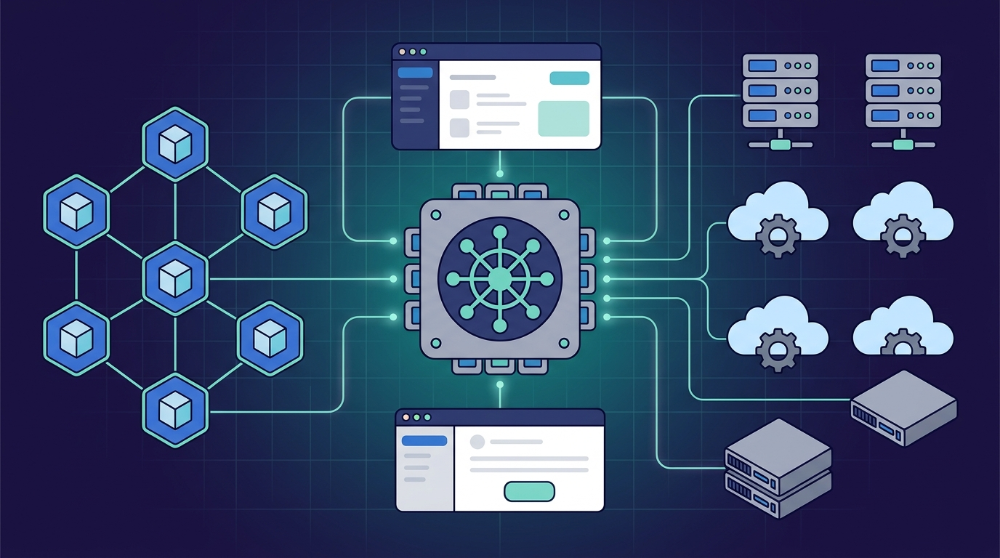

Solo.io sigue empujando su tesis de que la gobernanza de agentes IA es la próxima gran batalla de infraestructura. Esta vez el anuncio es sobre **agentgateway**, su gateway AI-native para conectar, asegurar y gobernar tráfico agentic: la edición Enterprise ahora corre en **dos modos**.

## Dos modos, un mismo producto

Hasta ahora, Solo Enterprise for agentgateway corría solo en Kubernetes —y con razón, porque el control plane y data plane aprovechan la alta disponibilidad, el escalado horizontal y el modelo GitOps del cluster. Eso no cambia. Lo nuevo es un **modo standalone**: una distribución empresarial autocontenida que corre en cualquier lado (VMs, ECS, incluso bare metal), con **UI de lectura y escritura** para configurar y administrar el gateway sin tocar un YAML.

El mensaje es que es el mismo producto: mismo modelo de políticas, mismo modelo de identidad, mismas capacidades de MCP gateway. Solo cambia la forma de operarlo según cómo trabaje tu equipo.

## Para quién es el modo standalone

El caso que pinta Solo.io es concreto: una empresa que acaba de comprar asientos de Claude Enterprise, donde IT es dueño del rollout y de la gobernanza de seguridad, pero su infraestructura actual **no incluye Kubernetes**. También aplica para equipos chicos que quieren un gateway al lado del resto de su stack sin levantar un cluster, para despliegues de gateway centralizados administrados por UI, y para entornos edge (barcos, plantas, locales retail) donde no hay ni platform team ni cluster. La regla resumida: **si puedes correr un proceso, puedes correr agentgateway**.

## El contexto que lo hace relevante

agentgateway viene creciendo fuerte: **más de 50 millones de descargas de imagen, más de 500 contribuidores** y reciente incorporación a la Agentic AI Foundation. Esa escala es la que empuja a Solo.io a cubrir modos de operación más diversos.

Sobre la base open source, la edición Enterprise agrega capacidades MCP de nivel corporativo: **composición de MCP** (encadenar varias herramientas en una), **code mode**, **search mode**, y un set de controles de identidad que llaman la atención —**brokered elicitation**, **impersonation**, **delegation** y **dual authentication**— pensados para que las credenciales del usuario nunca queden expuestas directamente al servidor MCP.

Es la misma jugada que ya venía haciendo Solo.io con agentdesktop: llevar la gobernanza de agentes desde el cluster hacia todos los rincones donde hoy viven los agentes. La diferencia acá es que el gateway en sí mismo deja de estar atado a Kubernetes.

Fuentes: [Solo.io blog](https://www.solo.io/blog/introducing-solo-enterprise-for-agentgateway-on-any-infrastructure), [GlobeNewswire](https://www.globenewswire.com/news-release/2026/09/10/3359872/0/en/solo-io-extends-agentic-governance-to-any-environment-with-solo-enterprise-for-agentgateway.html), [agentgateway.dev](https://agentgateway.dev/enterprise/).
