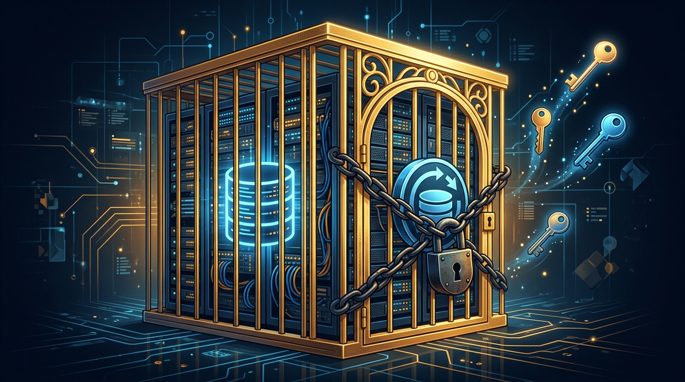

Salir de VMware se puso más difícil. **Broadcom** retiró silenciosamente el acceso público al **Virtual Disk Development Kit (VDDK)**, el SDK del que dependen prácticamente todas las herramientas de migración y backup de terceros. El movimiento fue documentado por **ShapeBlue** el 25 de agosto, pero el ruido recién estalló esta semana.

## Por qué importa el VDDK

El VDDK es la pieza que permite leer y manipular discos virtuales de vSphere. Herramientas como **Azure Migrate**, **Red Hat Migration Toolkit for Virtualization**, **Nutanix Move**, **ShapeBlue Migrate** y el motor open source **virt-v2v** lo necesitan para mover máquinas virtuales de VMware a otras plataformas.

El problema es estructural: la **licencia del VDDK prohíbe la redistribución**. Los vendors no pueden empaquetarlo en sus herramientas —tienen que bajarlo del portal de Broadcom—. Si el portal deja de ofrecerlo, la escalera de salida se rompe.

## La defensa de VMware

VMware salió a responder: según su lectura, **la licencia nunca fue para mover VMs**, y el fin de las descargas públicas responde a su política de controlar la distribución. No convence a nadie del lado de la migración. **Platform9** lo denunció abiertamente, porque su proyecto **vJailbreak** existe justamente para ayudar a las organizaciones a migrar fuera de VMware.

## El contexto más grande

Esto es la continuación de una estrategia que viene desde la compra por Broadcom en 2023: licencias más caras, menos productos independientes y ahora un estrangulamiento directo a las vías de escape. Para quienes ya estaban evaluando alternativas (KVM, OpenStack, cloud native), el mensaje es claro: **migrar ahora es más barato que migrar después**, porque cada mes que pasa Broadcom aprieta más la tuerca.

La decisión de fondo ya no es técnica: es si tu roadmap de infraestructura puede seguir casado con un proveedor que está cerrando las puertas de salida una a una.

Vía [The Register](https://www.theregister.com/virtualization/2026/09/10/vmware-defends-ending-downloads-of-sdk-that-helps-vm-backups-or-migrations-to-rivals/), [Virtualization Howto](https://www.virtualizationhowto.com/2026/09/leaving-vmware-just-got-harder-after-broadcom-pulled-vddk-downloads/) y [byteiota](https://byteiota.com/broadcom-pulls-vmware-vddk-exit-door-bolted/).
