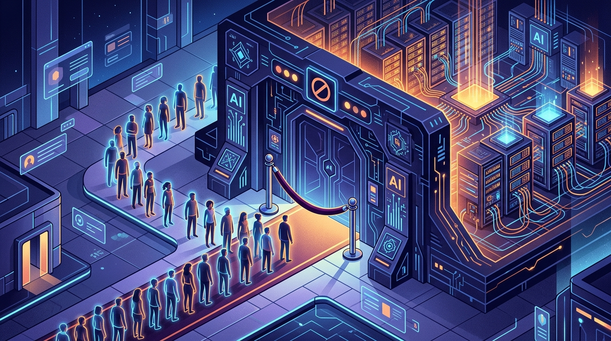

OpenAI tiene un problema que la mayoría de las startups envidiaría: su modelo nuevo es tan demandado que tuvieron que cerrar la puerta. La compañía **pausó las nuevas suscripciones de ChatGPT Pro**, el plan de **US$200 al mes**, porque GPT-6 Astra está estirando su infraestructura al límite.

El anuncio lo hizo Tibo Sottiaux, el product lead a cargo de Codex y ChatGPT, el 10 de septiembre. La razón es simple: no hay capacidad para todos. Las suscripciones Pro son las que más presionan los sistemas, así que OpenAI decidió frenar los registros nuevos mientras escala la infraestructura.

> *"Esas suscripciones son las que más presión meten a nuestros sistemas, y quisimos dar el paso más chico que nos permita seguir dando el acceso más amplio posible"*, explicó la compañía.

Lo importante: **quien ya está pagando Pro mantiene su acceso**. El congelamiento aplica solo a registros nuevos, y es global. Si intentas suscribirte hoy, quedas en lista de espera hasta que liberen capacidad.

### El contexto: Astra fue un éxito demasiado grande

GPT-6 Astra salió como preview limitado el **3 de septiembre** y, según los benchmarks, es el modelo más capaz de OpenAI hasta ahora — liderando en razonamiento (GPQA) y con números fuertes en coding y computer use. La demanda se disparó apenas estuvo disponible en el plan Pro, donde los usuarios tienen acceso prioritario al modelo en su configuración más pesada.

Esto no es gratis: ejecutar razonamiento de frontera a escala cuesta caro en cómputo, y OpenAI claramente no dimensionó (o no quiso dimensionar) la capacidad para el pico inicial. Prefirieron frenar la venta antes que degradar la experiencia de los suscriptores actuales.

### Por qué importa

Más allá del anecdótico "se nos acabaron las GPUs", esto deja un par de señales claras:

- **La demanda por IA de frontera supera la oferta de cómputo**, incluso para el líder del mercado. Es la misma historia que vimos con GPUs escasas, pero ahora en el nivel de *servicio*.
- **El cuello de botella se está moviendo del modelo al costo de servirlo.** Tener el mejor modelo no sirve de mucho si no puedes entregarlo a todos los que pagan por él.
- Es una prueba más de que la carrera de la IA se está definiendo tanto por **capacidad de inferencia** como por calidad de modelo.

Por ahora, si querías ChatGPT Pro tendrás que esperar. OpenAI dice que están agregando capacidad; cuándo reabren, todavía no tiene fecha.
