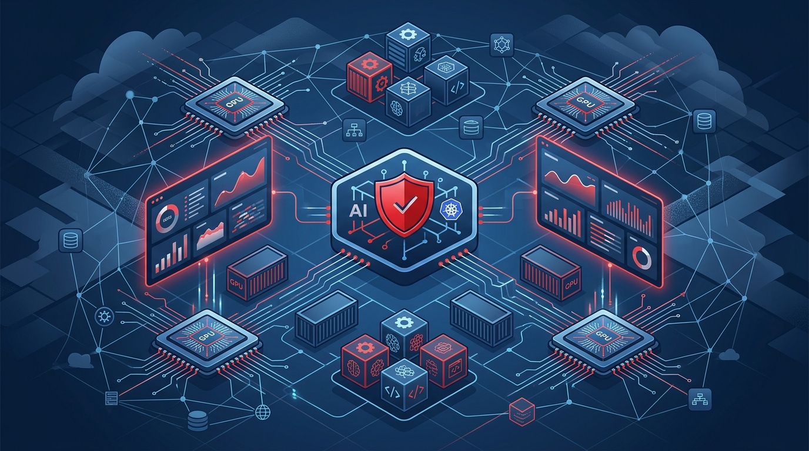

Red Hat soltó la versión 3.5 de su plataforma de IA y el mensaje es claro: la era de los pilotos se acabó. Ahora toca industrializar la IA como un servicio empresarial compartido, con la misma seriedad operativa que un cluster de OpenShift.

La pieza estrella es **EvalHub**, que llega a disponibilidad general. Básicamente te deja evaluar modelos, sistemas RAG y agentes *antes* de mandarlos a producción: automatiza pruebas de seguridad y genera reportes auditables para compliance. Además integraron los scores de **Garak**, una herramienta de evaluación de vulnerabilidades y comportamiento de modelos, al catálogo validado. Sumaron más de 20 modelos con métricas de seguridad, exposición de PII y riesgo de toxicidad — con Gemma 4, Nemotron 3 y Qwen en la lista.

Lo interesante es el giro operativo. Red Hat AI 3.5 agrega:

- **Métricas de inferencia y consumo de tokens por usuario**, pensadas para equipos de FinOps que necesitan saber quién se está gastando las GPU.
- **Fair-share GPU scheduling** y prioridades en el serving, para que un workload de fondo no le robe capacidad a una app que necesita latencia real.
- **Multi-tenancy con OpenShift Virtualization**, aislando tenants con su propio control plane sobre hardware compartido.
- **AutoRAG** y templates de agentes para acelerar proyectos sobre datos privados.

La plataforma también se expande a Kubernetes de terceros: disponibilidad general en CoreWeave Kubernetes Service y Microsoft Azure, con Amazon EKS en tech preview.

O sea, Red Hat está apostando a resolver la capa aburrida pero crítica: quién consume cada GPU, cuánto cuesta cada workload y cómo actualizar un modelo sin tumbar el servicio.
