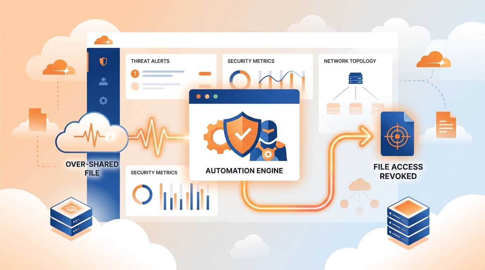

Cloudflare le pegó una sacudida a su CASB (*Cloud Access Security Broker*): el producto ahora **remedia los riesgos solo**, sin esperar a que un humano confirme cada acción. El anuncio se llama *automatic remediation policies* y convierte a CASB en un motor de automatización nativo, montado sobre la plataforma de desarrollo de Cloudflare One.

## De alarma pasiva a reflejo automático

Hasta ahora, las herramientas de *SaaS Security Posture Management* (SSPM) como CASB funcionaban como una alarma: te decían qué estaba mal, pero el "arreglar" seguía siendo pega del administrador. El problema no es menor: una sola política de archivos compartidos mal configurada en un tenant de Google Workspace puede generar **miles de hallazgos en segundos**, y el tiempo entre "detectar" y "remediar" se mide en horas o incluso días. Suficiente para que un archivo sensible se descargue, se reenvíe o quede indexado.

A principios de año Cloudflare había lanzado las **acciones de remediación manuales** —resolver la configuración directamente desde el dashboard, sin entrar a cada portal SaaS—. Pero seguía necesitando a una persona que confirmara cada remediación, aunque ya hubiera visto ese mismo tipo de hallazgo mil veces.

## Qué cambia ahora

Con las políticas nuevas, los equipos de seguridad definen la lógica de respuesta **una sola vez**, y CASB la ejecuta apenas detecta un hallazgo. En concreto, se puede:

- **Revocar el acceso a un file share riesgoso** de forma automática.
- **Despachar webhooks personalizados** hacia el SIEM, el sistema de tickets o la herramienta que corresponda.
- Encadenar acciones con lógica *event-driven*: si aparece un hallazgo de tipo X, ejecuta Y.

Traducido: lo que antes era una cola de "to-dos" que crecía sola, ahora se cierra en el momento en que nace el problema.

## La lectura para el que opera infra

El movimiento encaja con una tendencia más grande del ecosistema de seguridad cloud: **de la detección a la corrección autónoma**. CASB se suma a la fila de productos que están tratando de sacar al humano del loop en tareas repetitivas de remediación —con el riesgo de siempre: si la automatización se dispara mal, puedes revocar acceso a quien no debías. Por eso Cloudflare insiste en que la lógica es configurable y auditable, no una caja negra que borra permisos a ciegas.

Para equipos de seguridad chicos o con poco ancho, es una diferencia concreta: el "window" entre detección y remediación, que antes medías en horas, se comprime a segundos. Y en seguridad, ese margen suele ser la diferencia entre un susto y una filtración.

**Fuente:** [Cloudflare Blog](https://blog.cloudflare.com/casb-policies/).
