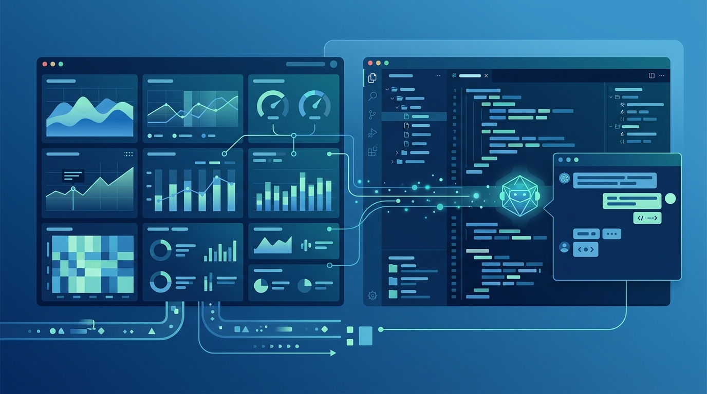

Los agentes de código venían a abaratar el software. Resulta que también van a multiplicar la cantidad de **cambios, fallas de producción y complejidad que hay que inspeccionar**. Y los dos pesos pesados de la observabilidad ya se están moviendo para quedarse con ese terreno.

## La jugada de cada uno

**Datadog** plantó la bandera primero: en la conferencia Goldman Sachs Communacopia del 10 de septiembre, la empresa dijo que la monetización de la **observabilidad de agentes de IA "ya comenzó"**, con miles de clientes usando la capacidad. Su tesis la bautizaron como una **"economía de inferencia"**: más aplicaciones y agentes de IA significan más actividad que monitorear, y el foco se corre desde "mirar releases hechos por humanos" hacia "trazar las decisiones continuas de software que se modifica a sí mismo".

**Dynatrace** respondió al día siguiente con algo más concreto: lanzó un **plugin verificado en el Cursor Marketplace**. Una sola instalación conecta Cursor con tu entorno Dynatrace mediante **Model Context Protocol (MCP)** y carga **30 skills de Dynatrace** (consultas, dashboards, notebooks y alertas). Traducido: le da al agente de código acceso al contexto de producción en vivo, directo dentro de su flujo de trabajo.

## El fondo del asunto

La pelea es por quién define la categoría. Datadog la está enmarcando (la "economía de inferencia" y el volumen de telemetría), mientras Dynatrace mete la telemetría de producción **dentro del editor donde ya está trabajando el agente**. Son dos defensas distintas ante el mismo miedo: si los agentes escriben, despliegan y arreglan software solos, ¿quién observa al observador?

Hay dos matices de negocio que vale la pena anotar. Datadog tiene el perfil de crecimiento más fuerte (Q2 con +36% de ingresos, US$1.120M), con un modelo basado en consumo que captura bien el volumen de inferencia. Dynatrace, en cambio, cobra el Cursor por **consumo de datos y no por asiento**, reduciendo la exposición a que los equipos de desarrollo se achiquen por culpa de la automatización. Su ARR creció 17% hasta US$2.136M, y el log-consumption anualizado llegó a US$200M.

## Por qué importa para tu equipo

El punto de fondo es más práctico que financiero: **los agentes de IA generan su propio problema de observabilidad**, y nadie tiene aún la respuesta canónica de cómo monitorear software que se auto-modifica. Lo que vemos esta semana es el inicio de la carrera por estandarizar eso.

Para los que operan infra, la señal es clara: si ya estás corriendo agentes de código en producción, la observabilidad de esos agentes va a dejar de ser un nice-to-have. Los proveedores están apostando a que será el próximo gran mercado, y tu stack —Datadog, Dynatrace o el que uses— va a querer ser el que registre qué hizo cada agente, por qué, y si el cliente terminó con la respuesta equivocada aunque el CI haya pasado en verde.

Fuentes: [Dynatrace blog](https://www.dynatrace.com/news/blog/investigate-production-issues-from-cursor-with-the-dynatrace-plugin/), [Insider Monkey](https://www.insidermonkey.com/blog/ai-agents-create-their-own-monitoring-problem-datadog-and-dynatrace-are-racing-to-own-it-1836978/), [The New Stack](https://thenewstack.io/ai-agent-trace-debugging/).
