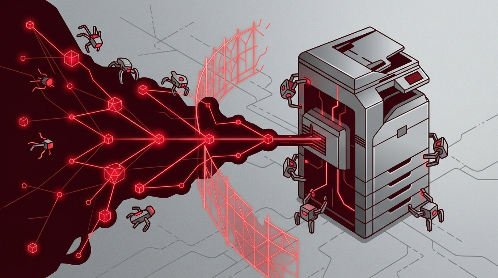

Esto no es un ejercicio de laboratorio ni una simulación: es la primera campaña documentada donde **un actor malicioso le delegó el trabajo pesado de una intrusión a cientos de agentes de IA**, y el resultado fue brutal. GreyNoise publicó el reporte "Agents Gone Wild" y los números son difíciles de ignorar: **al menos 440 servidores de PaperCut NG/MF comprometidos, repartidos en 395 organizaciones de 48 países**.

## Qué pasó exactamente

El 31 de agosto de 2026, un actor probablemente rusohablante —rastreado a la IP `45.142.193.132`— usó inteligencia artificial para **desarrollar, probar y refinar exploits** contra dos vulnerabilidades de PaperCut NG/MF: **CVE-2026-81578** y **CVE-2026-82078**. Lo que hace distinto a este caso es el método: no fue un humano escribiendo el exploit a mano, sino **un enjambre de agentes de IA construidos sobre el harness Codex de OpenAI y un modelo de DeepSeek**, a los que el atacante les encargó la tarea de armar, validar y ajustar el ataque.

El detalle técnico que importa: **CVE-2026-81578 es un bypass de autenticación en la interfaz web de PaperCut**, que permite a un atacante no autenticado modificar configuraciones del sistema. Con eso resuelto, el enjambre de agentes hizo el resto casi solo: explotó los servidores expuestos y exfiltró credenciales.

## Lo que asusta (y lo que no tanto)

La parte alarmante es la escala y la autonomía. Según los reportes independientes de **GreyNoise y Blackpoint Cyber**, los agentes de IA hicieron la mayor parte del trabajo de intrusión por su cuenta. Y un punto incómodo para los equipos de seguridad: **las credenciales exfiltradas siguen siendo válidas hasta que se roten**, así que el incidente no termina con parchear.

La parte que matiza el pánico: la campaña no escaló tan lejos como pudo. De los 440 servidores caídos, **solo 12 alcanzaron privilegios de dominio**. La contención lateral funcionó en la mayoría de los casos, lo que sugiere que la higiene básica —segmentación, monitoreo de lateral movement, respuestas rápidas— frenó lo que pudo ser mucho peor.

## Por qué importa

Esto marca un antes y un después en cómo pensamos la ciberdefensa. Hasta ahora hablábamos de agentes de IA como herramientas de productividad para *nosotros*: escribir código, automatizar deploys, resumir logs. Este caso es el espejo oscuro: **los mismos agentes, usados como mano de obra ofensiva escalable**, capaces de convertir una vulnerabilidad recién publicada en una campaña global en días.

Para los equipos de infra y seguridad, la lección es directa: el tiempo entre "falla divulgada" y "explotación masiva" se está acortando, y ya no es un humano el que corre la carrera. Rotación de credenciales, parches inmediatos y visibilidad sobre movimiento lateral dejan de ser buenas prácticas y pasan a ser la diferencia entre un susto y un desastre.

Fuentes: [GreyNoise](https://www.greynoise.io/blog/ai-orchestrated-campaign-against-papercut-ng-mf), [The Hacker News](https://thehackernews.com/2026/09/papercut-attacker-uses-hundreds-of-ai.html), [BleepingComputer](https://www.bleepingcomputer.com/news/security/ai-powered-attack-exploited-papercut-flaws-to-hack-395-organizations/), [SecurityWeek](https://www.securityweek.com/papercut-flaws-exploited-in-ai-powered-attacks/).
