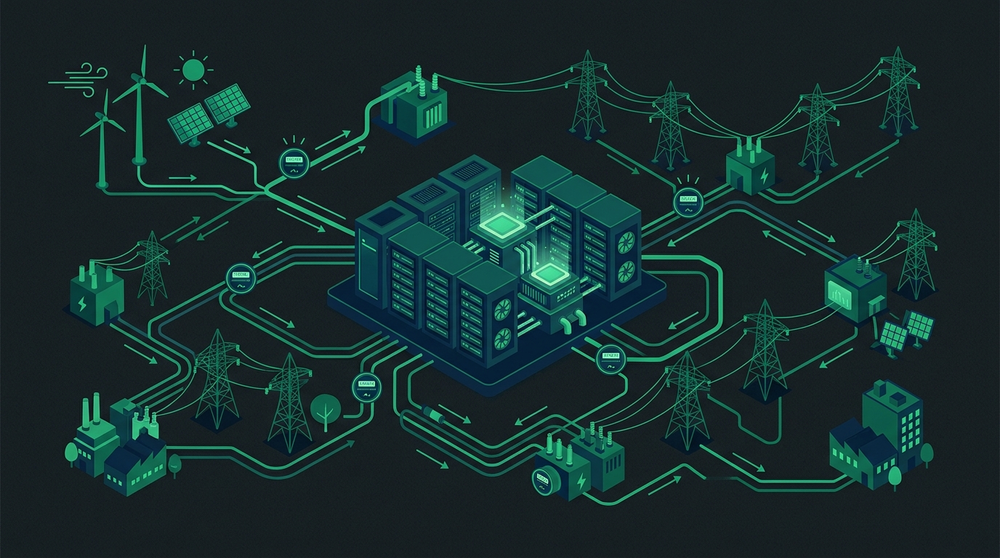

El cuello de botella de la IA ya no es solo el silicio: es la **electricidad**. Y acá llega una señal fuerte de que los grandes se están coordinando para que los data centers dejen de ser "ese vecino que se chupa toda la red". Este martes, **Emerald AI, Google y NVIDIA** lanzaron la **AI Energy Management Alliance (AEMA)**, una coalición que arranca con **18 empresas** del mundo de la IA y la energía.

## De qué se trata

El objetivo es simple de enunciar y peludo de ejecutar: **data centers "flexibles"** capaces de **modular dinámicamente su consumo eléctrico** en respuesta a las condiciones de la red. O sea, cuando el sistema eléctrico está exigido, el data center baja la carga; cuando hay holgura, la sube. La idea es dejar de ser un problema para la red y pasar a ser un **"buen ciudadano"** del sistema eléctrico, como lo plantean los fundadores.

## Quiénes están adentro

La coalición junta a los dos lados del mostrador: los que consumen energía y los que la producen. Entre los miembros fundadores aparecen el lab de IA de frontera **Anthropic**, la utility **National Grid** y los generadores **AES** y **NRG**. La lista de 18 mezcla pesos pesados de la IA con actores del sector eléctrico, algo poco común en este tipo de alianzas y justamente lo que la hace interesante.

## Por qué importa

El contexto le da el peso: la demanda de los data centers de IA viene creciendo a un ritmo que la generación y la transmisión no pueden seguir tan fácil. La apuesta de AEMA es atacar eso desde la **flexibilidad de la demanda** en vez de esperar solo a que llegue más oferta. En la práctica, eso significa orquestar el consumo de los clústeres para que se alinee con la disponibilidad de la red — un giro de "más power siempre" a "el power correcto en el momento correcto".

Para los que operan infraestructura a escala, la señal de fondo es que **la energía se está volviendo una variable de diseño de primer orden** en la IA, al mismo nivel que el silicio o el software. Y cuando Google, NVIDIA y Anthropic se sientan en la misma mesa con utilities y generadores, es porque el tema ya dejó de ser un problema teórico.

**Fuentes:** [NVIDIA Blog](https://blogs.nvidia.com/blog/ai-energy-management-alliance/), [Fortune](https://fortune.com/2026/09/16/data-centers-ai-energy-management-alliance-emerald-google-nvidia-anthropic/), [The Next Web](https://thenextweb.com/news/ai-energy-management-alliance-google-nvidia-emerald-flexible-data-centres).
