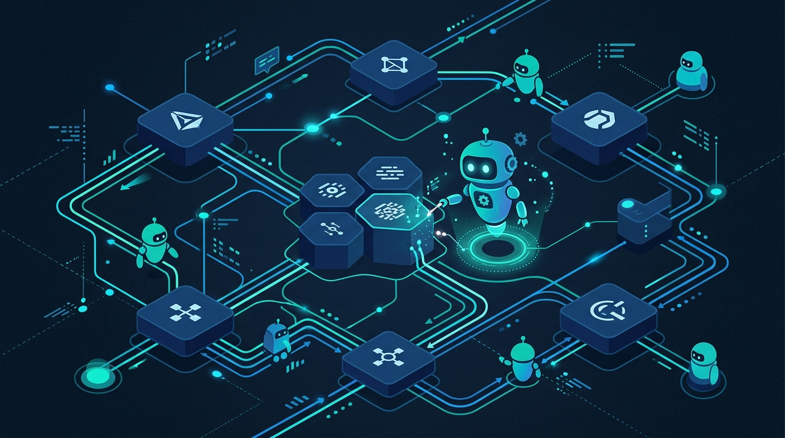

La moda de "meterle agentes a todo" ya llegó al turno de guardia de Kubernetes. **Komodor**, la startup que se hizo conocida por su plataforma de troubleshooting para Kubernetes, anunció este martes la **Komodor Agentic Operations Platform**, una apuesta para que los equipos de producción desplieguen flujos de trabajo autónomos sin partir de cero.

## De qué se trata

La idea central es simple de vender y difícil de ejecutar: los equipos de SRE y plataforma están tapados en carga operacional, y la respuesta no es contratar más gente, sino **automatizar con agentes**. Komodor propone dos piezas:

- **Workflows listos para usar** (ready-to-run): automatizaciones pre-armadas para las tareas que más queman tiempo. El paquete **AI SRE** incluye troubleshooting e incident management, *alert intelligence* y optimización proactiva de confiabilidad. Y el módulo de **optimización de costos** ataca reducción de gasto en cloud, observabilidad y el propio Kubernetes.
- **Backbone para agentes personalizados**: un sustrato para que cada equipo construya sus propios agentes encima, con la promesa de desplegarlos de forma "rápida y segura".

## Por qué importa

El patrón que viene empujando Komodor no es nuevo — Grafana, Datadog y Dynatrace ya vienen metiendo agentes a la observabilidad—, pero acá el foco es distinto: **ejecutar acciones, no solo explicar qué pasó**. Pasar del "te digo qué se cayó" al "lo arreglo mientras duermes".

El mensaje de fondo: la producción ya no se escala con más manos, se escala con **workflows autónomos con guardarraíles**. La pregunta abierta, como siempre con esto, es cuánta autonomía le vas a dar a un agente que tiene permisos para tocar tu clúster de producción. La propia Komodor habla de desplegar "de forma segura", que es justamente el detalle donde se van a jugar la confianza.

**Fuentes:** [Komodor (GlobeNewswire)](https://www.globenewswire.com/news-release/2026/09/16/3363246/0/en/komodor-launches-agentic-operations-platform-combining-ready-to-run-automation-with-a-comprehensive-backbone-for-custom-agents.html)
