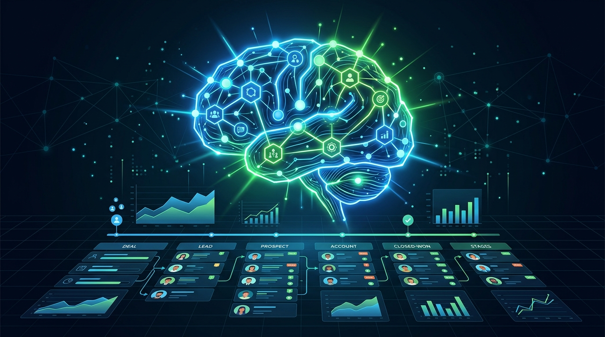

Salesforce se puso las pilas con la IA y, en pleno Dreamforce, se asoció con NVIDIA para presentar **Koa**, su primer modelo de razonamiento enfocado 100% en CRM. La apuesta es grande: meterle cabeza real a los agentes de **Agentforce** para que resuelvan tareas complejas de varios pasos, no solo responder mensajes sueltos.

## De qué se trata

Koa no es un modelo cualquiera que sacaron de la galera. Viene **post-entrenado sobre NVIDIA Nemotron 3 Super**, la base de pesos abiertos de NVIDIA, y refinado con **27 años de inteligencia de CRM de Salesforce**. En criollo: le metieron décadas de cómo se comportan los clientes, los pipelines de venta y los flujos de servicio, para que el modelo "entienda el negocio" en lugar de ser un LLM genérico disfrazado.

Lo más llamativo es dónde corre: **todo dentro de la propia infraestructura de Salesforce**. Nada de depender de un hyperscaler externo para servir el modelo. Eso les da control total sobre datos, despliegue y, de paso, responde a la preocupación cada vez más fuerte de las empresas por no regalar su data.

## Koa en acción

Koa está disponible para **clientes piloto a través de Agentforce**, la plataforma de agentes de Salesforce. Ahí un gateway decide qué modelo usar según cada request, así que Koa se integra como una pieza más del ecosistema en lugar de reemplazar todo de golpe.

La idea es que los agentes pasen de "responder" a "razonar": encadenar pasos, entender contexto de negocio y cerrar tareas multi-etapa en ventas, servicio y soporte.

## Por qué importa

Esto marca una tendencia clara: **las empresas grandes ya no quieren alquilar la inteligencia, la quieren de casa**. Salesforce, Microsoft, y otros gigantes del software corporativo están moviendo sus modelos hacia infraestructura propia, apalancándose en pesos abiertos como los de NVIDIA. El mensaje para el mercado es que el reasoning ya no es exclusivo de los laboratorios de frontera: llegó al software de negocio de todos los días.

Mientras tanto, Jensen Huang lo resumió a su estilo en Dreamforce: *"Ahora podemos saberlo todo y hacerlo todo."* Veremos si los clientes de Salesforce opinan lo mismo cuando les llegue la boleta.
