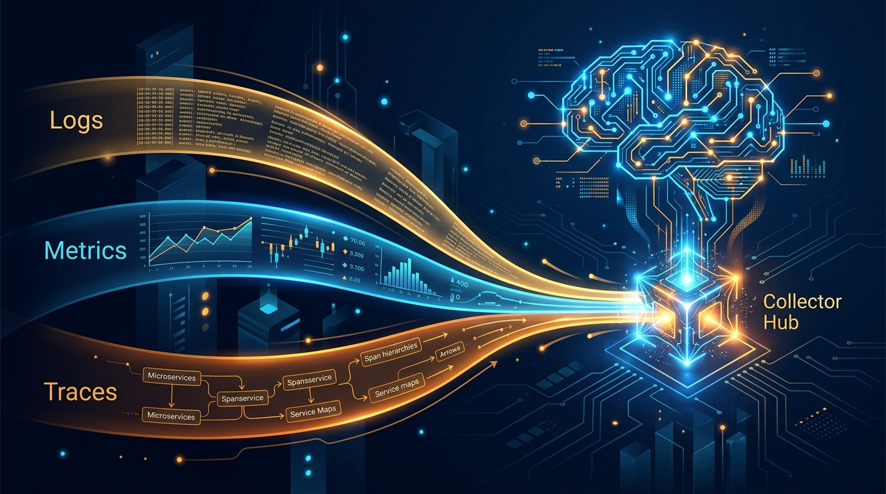

Splunk está apostando fuerte a que la IA no se observa igual que el software de antes. En su **.conf26** de esta semana, la empresa (ahora brazo de Cisco) confirmó dos movidas que apuntan directo a la observabilidad de la era agéntica: un **segundo LLM open source**, esta vez entrenado para razonar sobre *logs*, y un **Universal Collector** que unifica la ingesta de telemetría con OpenTelemetry.

## Un LLM no sirve para todo

La tesis de Splunk es simple y tiene sentido: los modelos de propósito general se entrenaron con texto, código y video, así que se atragantan con datos de telemetría. Las **métricas son datos numéricos** que necesitan un modelo entrenado específicamente para consumirlos. Por eso ya existía el **Cisco Time Series Model 1.0**, un modelo abierto en Hugging Face pensado para métricas.

Ahora viene la segunda pieza: un modelo entrenado para analizar y razonar sobre **logs** (y, por extensión, traces). El argumento de fondo es práctico: podrías tirar logs a un modelo general, pero el volumen de datos **desborda la ventana de contexto**. Un modelo dedicado razona sobre esa data de forma más eficiente.

**Raja Mukhopadhyay**, VP de observability cloud de Splunk, lo resume así: la explosión de telemetría que generan los agentes de IA ya no se puede mirar con las herramientas de siempre.

## El Universal Collector, la otra mitad

La segunda novedad es el **Universal Collector**, esperado en **beta para 2027**, que promete simplificar la recolección de todo tipo de telemetría usando una instancia de **OpenTelemetry**. La idea es dejar de desplegar repositorios separados para cada tipo de dato y poder **correlacionar eventos entre DevOps, operaciones de TI y seguridad** sin fricción extra.

Es un guiño claro a lo que se viene: cuando los agentes empiecen a generar código en un lenguaje máquina que los humanos no puedan leer, la observabilidad se va a tener que resolver entre agentes que validan a otros agentes. Splunk está plantando esa bandera ahora, antes de que el problema se vuelva imposible de ignorar.

## El contexto que importa

No es un capricho aislado. Con los equipos de DevOps desplegando flotas de agentes autónomos, la cantidad de telemetría crece a un ritmo que la instrumentación tradicional no da abasto. La apuesta de Splunk —modelos abiertos especializados + un colector unificado— es una respuesta concreta a esa presión, y encaja con la tendencia que ya vimos en Datadog y Dynatrace de meter IA profunda en el pipeline de observabilidad.

Para el que opera infra: no hay que correr a migrar nada hoy, pero la dirección es clara. El futuro de la observabilidad no es "más dashboards", es **modelos que entienden la telemetría mejor que un ingeniero mirando un gráfico a las 3 de la mañana**.

Fuente: [DevOps.com](https://devops.com/splunk-preps-second-open-source-llm-for-telemetry-data/).
