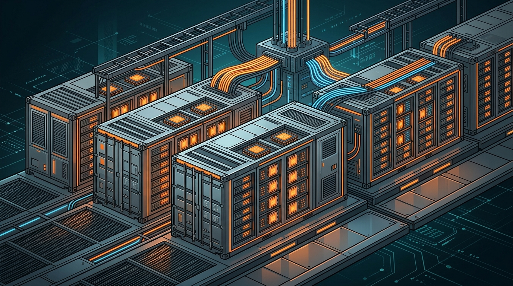

**Crusoe**, el desarrollador de data centers conocido por construir el campus de Abilene (Texas) que usa OpenAI, cerró el **primer tramo de su Serie F por US$3.900 millones**, dejando su valuación post-money en **US$30.900 millones**. Es una de las rondas de infraestructura de IA más grandes del año.

## Quién puso la plata

La ronda fue **co-liderada por Atreides Management, Mubadala Capital y Valor Equity Partners**, con participación de **Nvidia**, Qatar Investment Authority (QIA) y Founders Fund, entre otros. El dato de Nvidia metiéndose como inversor no es menor: valida a Crusoe como cliente estratégico y socio del ecosistema GPU.

## Qué van a hacer con la plata

Crusoe se autodefine como el primer proveedor de infraestructura de IA **verticalmente integrado**. La plata nueva va a dos frentes:

- **Data centers masivos** a gran escala para cargas de entrenamiento e inferencia de modelos de frontera.
- **"AI factories" modulares** (las Spark Factories): unidades tipo contenedor, desplegables rápido y más cerca de donde se necesita el cómputo.

La apuesta es clara: no todos los workloads de IA justifican un campus gigante. Los módulos pequeños permiten arrancar antes y escalar según demanda, una lógica que pega directo con la fiebre actual por capacidad de GPU.

## El contexto más amplio

Esto llega en un momento donde la carrera por energía y chips define la agenda. Crusoe ya había aparecido como **miembro Silver de la CNCF** hace un par de semanas, y ahora suma munición financiera pesada. Según la cobertura, ya hay **conversaciones de IPO en curso**.

Para el mundo cloud y Kubernetes, la señal es doble: la infraestructura de IA se está volviendo **modular y descentralizada**, y los jugadores de nicho (no solo los hyperscalers) están levantando capital serio para competir. Vale la pena seguir a Crusoe de cerca.
