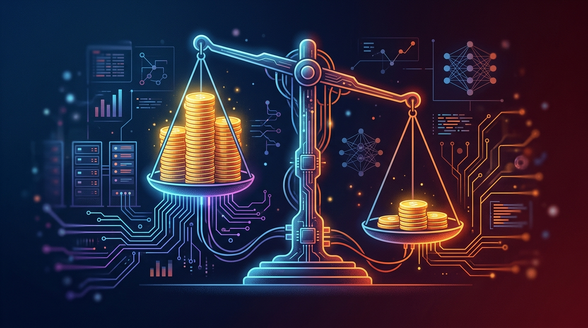

Todos los modelos de IA chinos **combinados** generan apenas un **10%** de los ingresos que reportan OpenAI y Anthropic juntos. Esa es la conclusión del think tank estadounidense **Rhodium Group**, publicado el jueves, y que mete presión directa sobre las valuaciones de las startups chinas.

## Los números que duelen

Según las estimaciones, los modelos chinos facturaron cerca de **US$10.700 millones de ingreso recurrente anual (ARR)** entre marzo y agosto, contra **más de US$100.000 millones** combinados de OpenAI y Anthropic. La brecha es brutal: por cada dólar que factura el ecosistema chino, los dos lab americanos facturan diez.

El dato viene justo cuando China **duplica su capex** en el sector, según el mismo informe, con Beijing empujando hasta US$139.000 millones en infraestructura y chips. Adopción rápida sí hay; monetización, todavía no.

## Valuaciones bajo la lupa

La asimetría se hace más evidente con las valuaciones: varias startups chinas cargan múltiplos **más altos** que sus rivales americanos, pese a facturar una fracción. En el radar de salidas a bolsa:

- **Anthropic** se espera que liste en EE.UU. el próximo mes.
- **OpenAI** empujó su IPO para el próximo año.
- **Moonshot** ya habría presentado papeles confidenciales para una IPO en Hong Kong.
- **DeepSeek** también prepara su listing.

El contraste es la tesis central: los modelos chinos ganan usuarios con precios bajos (DeepSeek viene recortando tarifas a la mitad), pero ese volumen no se traduce en plata todavía.

## El subtexto político

El informe aterriza en pleno debate sobre quién lidera la carrera. **Dario Amodei**, CEO de Anthropic, ha sido de los que más ha advertido sobre un supuesto adelanto chino en IA. Los datos de Rhodium sugieren que, al menos en el frente comercial, la ventaja sigue del lado americano —por ahora.

La lectura para los que seguimos el sector desde la infra y el cloud: el mercado chino pelea por volumen y costo, mientras OpenAI y Anthropic consolidan el negocio enterprise. Dos estrategias, y por el momento solo una está cobrando.
