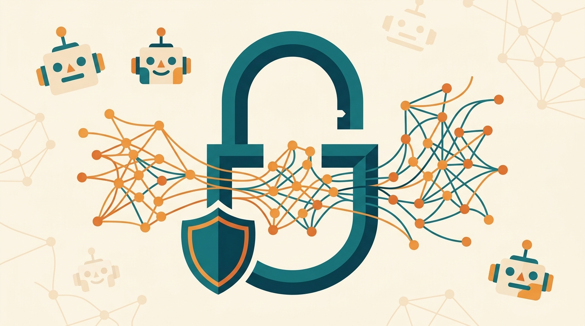

La seguridad de los modelos open-weight se está tomando la conversación, y ahora hay tres jugadores que quieren ponerle orden. **Baseten** —a través de su brazo de investigación **Base Labs**— se alió con **Hugging Face** y **Goodfire AI** para construir una infraestructura abierta de evaluación y monitoreo de seguridad para modelos de pesos abiertos.

## ¿Cuál es el problema?

La cosa parte de una técnica que viene subiendo fuerte: la **abliteración**. Básicamente, alguien toma un modelo open-weight, le "borra" las salvaguardas de seguridad que trae de fábrica y lo convierte en un modelo que responde cosas que el original jamás haría. El problema es que hoy no existe una forma estándar y transparente de detectar cuándo un modelo fue intervenido así.

## ¿Qué van a hacer?

La alianza quiere cubrir el ciclo completo del modelo, desde el **entrenamiento hasta el serving en runtime**. La idea es entregar herramientas públicas para:

- **Evaluar** qué tan seguro es un modelo antes de ponerlo en producción.
- **Monitorear** su comportamiento una vez desplegado.
- **Detectar** modelos "abliterados" o con salvaguardas removidas.

Con Hugging Face (el hub más grande de modelos) y Goodfire (especialistas en interpretabilidad) a bordo, la propuesta apunta a convertirse en el estándar de facto para auditar modelos abiertos.

## Por qué importa

El debate sobre los modelos open-weight viene caliente: son fáciles de descargar, modificar y desplegar, pero también de "destripar" para fines maliciosos. Que una infraestructura de seguridad sea **abierta y colaborativa** —en vez de un servicio propietario de un solo vendor— es un paso lógico para un ecosistema que justamente se define por ser abierto.

Estaremos atentos a si otras plataformas y labs se suman a la mesa.
