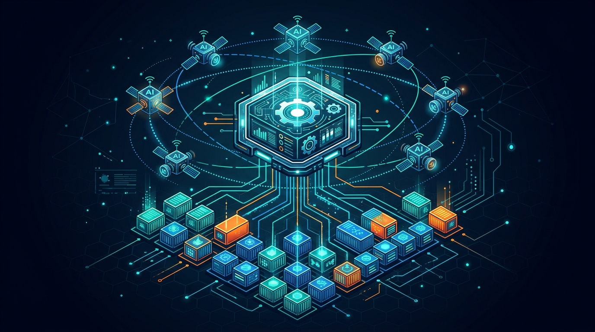

WSO2 anunció la **disponibilidad general de Agent Manager**, un control plane **open source** pensado para domar el "agent sprawl" que ya empieza a doler en las empresas. La idea: separar la **gobernanza** de los agentes de su lógica, para aplicar controles comunes sin importar el modelo, el framework o el runtime de abajo.

## Qué trae la versión GA

Agent Manager venía en beta desde junio, y la versión estable suma tres piezas clave:

- **Identidad verificable de agentes**: RBAC, delegación, intercambio de tokens y revocación de acceso. Porque un agente no es una app cualquiera: puede invocar tools, tocar APIs y delegar en otros agentes.
- **Gobernanza a nivel MCP** (Model Context Protocol), para controlar las interacciones entre agentes y herramientas.
- **Runtime sandboxed nativo de Kubernetes**, para ejecutar agentes en un entorno controlado y observable.

Todo corre en **cloud, on-premises o híbrido**, sin amarrarse a un proveedor de IA en particular.

## El contexto

La fragmentación es el problema de fondo: hoy se pueden construir agentes con una decena de modelos y frameworks, pero la infraestructura para manejar su identidad, permisos y ciclo de vida sigue repartida en mil lugares. WSO2 propone una capa central —inventario, staging, producción y suspensión de agentes— independiente del runtime.

Para los que vivimos en Kubernetes y DevOps, es otra señal de que la gobernanza de agentes está dejando de ser un checklist de compliance para convertirse en **infraestructura de runtime**. El control plane de los agentes se está pareciendo cada vez más al control plane de los contenedores.
