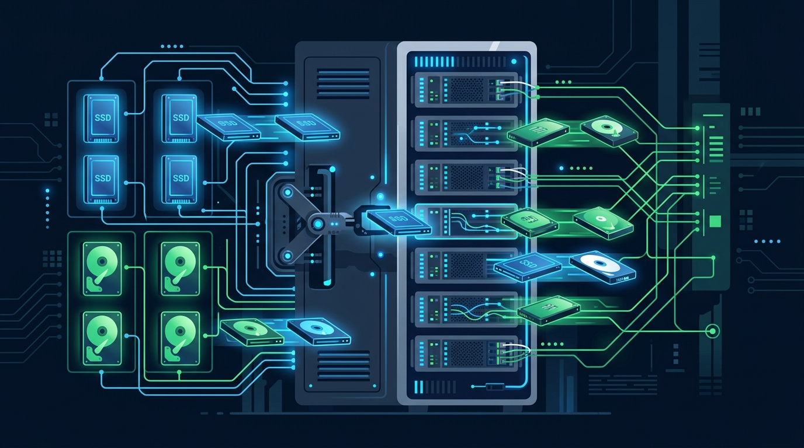

Google Kubernetes Engine (GKE) acaba de simplificar una de esas tareas que nadie disfruta: decidir qué tipo de disco usar según el hardware del nodo. La nueva **Dynamic Default Storage Class** hace que GKE elija automáticamente entre **Persistent Disk (PD)** e **Hyperdisk** en función de la compatibilidad de cada nodo, sin que tengas que andar configurando storage classes a mano.

## El problema de fondo

Los clústeres GKE de generaciones mixtas son un dolor conocido: nodos con distinta familia de máquinas soportan distintos backends de almacenamiento. Algunos funcionan con PD tradicional, otros con Hyperdisk (el disco de alto rendimiento de Google). Antes de esto, tenías que manejar storage classes separadas y preocuparte de que cada workload cayera en un nodo con el disco correcto — o arriesgarte a fallos de aprovisionamiento.

La Dynamic Default Storage Class viene a resolver justo eso: **un solo default que resuelve el backend correcto según el nodo donde aterrice el pod**.

## Cómo funciona

- GKE evalúa la compatibilidad de hardware del nodo donde se programa el volumen.
- Selecciona automáticamente entre **Persistent Disk** e **Hyperdisk**.
- Elimina la fricción de mantener storage classes explícitas para clústeres heterogéneos.

La lectura para los que operamos GKE en producción: menos YAML de storage, menos errores de "disk type no soportado" y una migración más limpia hacia Hyperdisk en clústeres mixtos. Otra pieza de "the boring stuff just works" que en el día a día vale oro.

**Fuente:** Google Cloud Blog (anuncio de novedades de GKE, septiembre 2026).
