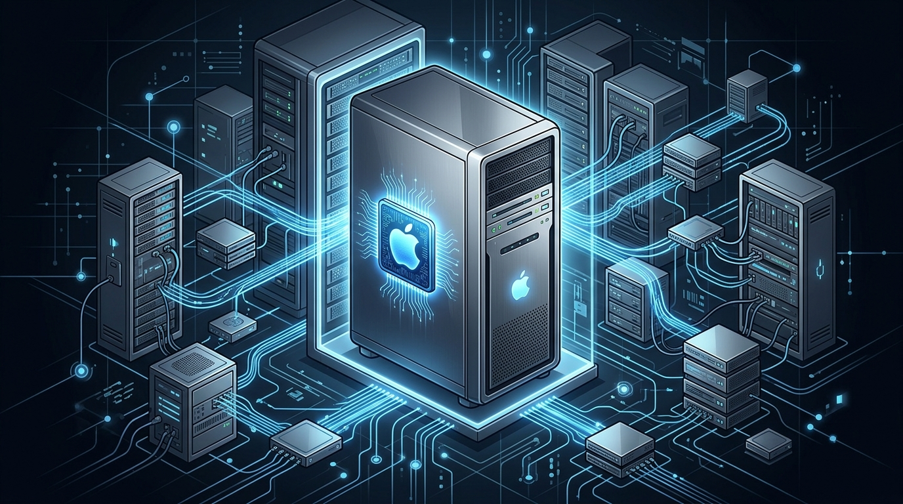

Apple estaría preparando uno de sus giros de hardware más grandes en años: **volver al mercado de servidores enterprise, esta vez con la IA en el centro**. Según un reporte de **The Information**, la compañía desarrolla un servidor de inferencia construido sobre sus futuros chips **M8 Ultra**, en configuraciones de dos y cuatro chips.

## El regreso que no veíamos venir

Apple abandonó el mercado de servidores en **2011**, cuando descontinuó la línea Xserve. Desde entonces, su hardware "de datacenter" brilló por su ausencia —salvo por los Macs que las empresas de IA compraban por su cuenta para correr workloads. Ahora la jugada sería distinta: un equipo pensado desde cero para **inferencia de modelos de IA**, vendido directo a desarrolladores, empresas y gobiernos.

El proyecto, según The Information, habría arrancado hace cerca de un año, cuando **John Ternus** era jefe de ingeniería de hardware. Ternus asumió como CEO de Apple el 1 de septiembre, así que el timing le da pista a la continuidad de la iniciativa.

## Las dos configuraciones

- **Versión compacta**: dos chips M8 Ultra.
- **Versión grande**: cuatro chips M8 Ultra.

El foco estaría en **inferencia** —correr modelos ya entrenados y generar respuestas—, no en entrenar modelos gigantes. Un lanzamiento, si llega, se proyecta recién para **2029**, y Apple no ha confirmado nada: el proyecto podría cambiar o cancelarse.

## El detalle que sorprende: Nvidia en la ecuación

Lo más llamativo del reporte es que Apple **considera usar NVLink Fusion de Nvidia** para conectar sus propios chips M8 Ultra entre sí. NVLink Fusion incluye hardware y software para que los procesadores se comuniquen a velocidades altísimas dentro del equipo. Para una empresa que construye todo su silicio in-house y evita depender de terceros, abrir la puerta a la interconexión de Nvidia es un guiño poco usual.

## Por qué ahora

La demanda viene empujando: las empresas de IA llevan meses comprando Macs a mansalva para inferencia. El reporte de The Information apunta que **OpenAI compró decenas de miles de Mac minis**, y que **Anthropic arrienda Mac minis a través de Amazon Web Services**. O sea, Apple ya vende (sin querer) el hardware de inferencia que el mercado quiere; ahora lo estaría empaquetando como producto de servidor.

## La lectura

Es un movimiento con lógica de oferta y demanda, pero con un montón de incógnitas: ¿software de gestión remota, herramientas de developers, soporte enterprise? Esos son terrenos donde Dell, HPE y Lenovo llevan décadas. Si Apple quiere entrar de verdad, no le basta con el silicio: tiene que armar un ecosistema de servidor que hoy no tiene.

Aun así, la señal es clara: la fiebre de inferencia on-premise es tan fuerte que hasta Apple —el rey del dispositivo de consumo— está mirando de reojo el rack del datacenter. Veremos si termina en producto o en rumor de pasillo.

**Fuente:** The Information (vía WION, Yahoo Finance, Shopifreaks, DigiTimes y cobertura internacional).
