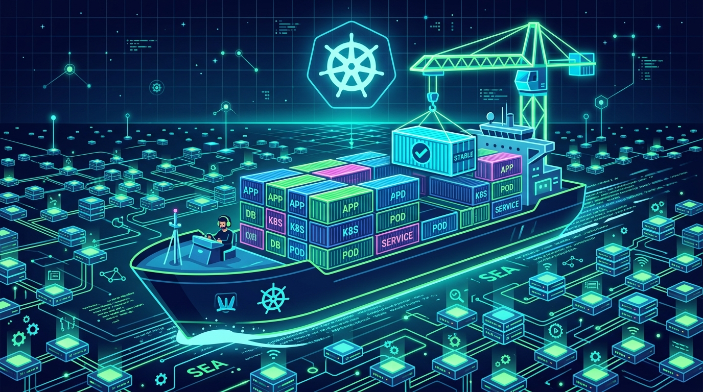

La Cloud Native Computing Foundation liberó **Kubernetes 1.37, bautizado "Garhwal"**, y el foco está claro: estabilidad, seguridad y optimización para cargas de IA/ML. No es un release lleno de fuegos artificiales, pero trae varias piezas que llevaban años madurando y que al fin llegan a estable.

## Lo que sube a stable

- **Metrics API en GA**: `metrics.k8s.io` se consolida como la vía estándar para medir salud de nodos y pods, alimentando el Horizontal Pod Autoscaler (HPA), el Vertical Pod Autoscaler (VPA) y comandos como `kubectl top`. Era una de esas APIs que todo el mundo usaba en producción pero seguía "en beta" sobre el papel.
- **Dynamic Resource Allocation (DRA)**: tres features alcanzan stable — *Extended Resources*, *Device Taints and Tolerations* y *Resource Claim Status*. La DRA viene empujando desde hace varios releases para manejar GPUs y hardware especializado de forma más fina, clave para el boom de cargas de IA.
- **Pod certificates en stable**: soporte nativo para mTLS pod a pod sin depender de herramientas externas para bootstrap de certificados. Adiós a una pieza de fricción en la comunicación segura entre servicios.
- **Resilient watchcache initialization** en GA: antes, cuando el kube-apiserver reiniciaba o perdía conexión de caché en clústeres grandes, inundaba etcd con requests y podía tumbar el control plane. Ahora delega requests acotados y responde HTTP 429 con gracia en vez de colapsar.

## Lo nuevo en beta y alpha

- **Kubelet rootless en beta** (feature gate `KubeletInUserNamespace` activado por defecto): el kubelet y componentes core del nodo corren como no-root usando user namespaces de Linux. Reduce el impacto de un ataque de container escape.
- **Gang scheduling en beta**: pensado para trabajos de IA/ML que requieren que varios pods arranquen juntos.
- **Checkpoint y restore de pods (alpha)**: el kubelet puede crear un checkpoint de un contenedor en ejecución (memoria, process tree) para debug o análisis de seguridad.
- **Recreate strategy para StatefulSet (alpha)**: permite eliminar todos los pods de un StatefulSet de una, para recuperación limpia de pods atascados sin borrado manual.

## La foto completa

Kubernetes 1.37 incluye **67 enhancements**: 27 en alpha, 23 subiendo a beta, 16 llegando a stable y 1 deprecación. La próxima versión, 1.38, se espera para **diciembre de 2026**.

La lectura para los que operamos clústeres: es un release de "maduración" más que de novedades rimbombantes. Metrics API y watchcache resiliente en particular son mejoras silenciosas que van directo a la estabilidad del día a día.

**Fuente:** CNCF / InfoQ — release notes de Kubernetes 1.37.
