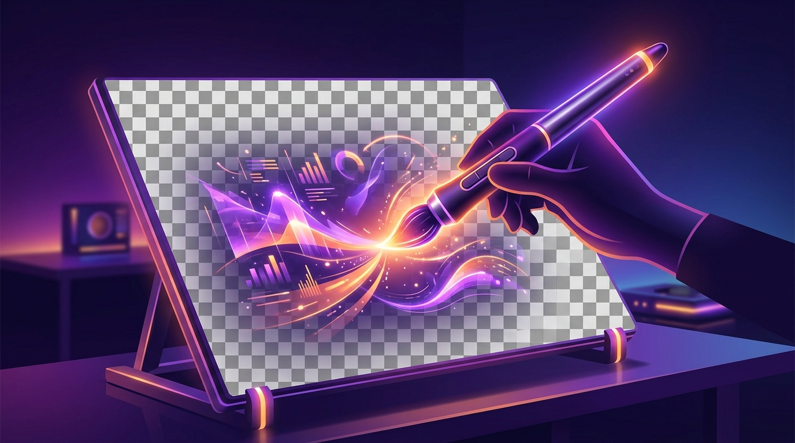

El equipo Qwen de Alibaba liberó **Qwen-Image-2.1**, un modelo **open-weight de 7B parámetros** que unifica generación de imágenes desde texto y edición en un solo workflow. El punto que lo distingue de la competencia: **transparencia RGBA nativa** para crear y editar assets sin fondo.

## Qué trae de nuevo

- **Compacto y eficiente**: una arquitectura liviana con *mixed-granularity attention* y reuso de caché KV en el prefijo, que promete buena calidad de imagen a bajo costo computacional. Son 32 capas Single-Stream DiT en el componente visual.
- **Transparencia nativa, creación y edición unificadas**: genera imágenes regulares o transparentes (RGBA) desde texto, edita capas transparentes y extrae sujetos de fotografías —todo en el mismo modelo.
- **Edición versátil**: soporta hasta **10 imágenes de referencia**, ediciones locales vía círculos, anotaciones pintadas o máscaras separadas, y preservación de identidad para personas y productos.
- **Mejor estética**: tipografía mejorada, iluminación de retratos y detalles finos más pulidos.

## El catch: la licencia

Acá está el asterisco. Qwen-Image-2.1 se distribuye bajo la **Qwen Research License**, que **prohíbe el uso comercial sin un acuerdo separado**. O sea: podés bajar el modelo, inspeccionar la implementación y armar un prototipo, pero meterlo en un producto de pago requiere negociar otra licencia con Alibaba.

La lectura es clara: es un **release de investigación** con funciones prácticas poco comunes —sobre todo la creación y edición de assets transparentes con múltiples referencias—, no un regalo open-source para producción.

## Detalles técnicos

- Salida de hasta **2K** (2048x2048 en 1:1, y aspect ratios 16:9, 9:16, 4:3, 3:4, entre otros).
- Se corre vía `diffusers` con el pipeline `QwenImage21Pipeline`, con soporte de `torch>=2.4` y `transformers>=5.17`.
- Disponible en **Hugging Face y ModelScope**, con demo pública y blog oficial.

En el tablero de los modelos chinos, Alibaba sigue marcando ritmo: tras la ola de razonamiento y los modelos de lenguaje, ahora apunta al terreno de la generación visual con un enfoque de "gen + edit" unificado. Veremos si la licencia de investigación le pesa frente a alternativas más permisivas.

**Fuente:** Hugging Face / Qwen Blog / TechNode — lanzamiento de Qwen-Image-2.1.
