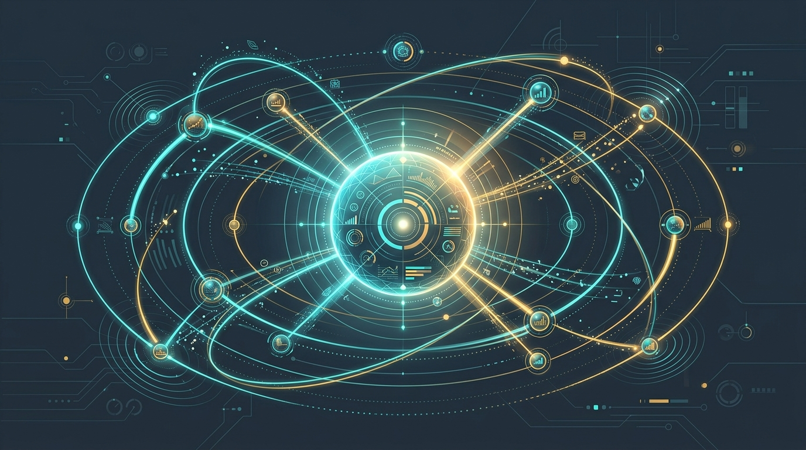

La observabilidad de agentes de IA dejó de ser un tema de nicho y AWS acaba de meter su apuesta grande: **CloudWatch Omni**, una plataforma para unificar la telemetría de agentes y aplicaciones en un solo lugar.

## Qué trae Omni

La idea es simple: los agentes ya no son solo un endpoint de API, son sistemas distribuidos que tocan modelos, tools, APIs y datos. CloudWatch Omni junta **logs, métricas, traces y evaluación** de esos agentes bajo un mismo techo, sin tener que armar un Frankenstein de herramientas.

El soporte de lanzamiento cubre los frameworks más usados del ecosistema:

- **LangGraph**, **CrewAI**, **OpenAI Agents SDK**, **Vercel AI SDK** y **AWS Strands**.
- Herramientas de evaluación como **Braintrust**, **DeepEval** y **Ragas**.

O sea, si ya estás armando agentes con cualquiera de esos stacks, puedes traerlos a Omni sin reescribir todo.

## Disponibilidad y costo

Omni arranca en **tres regiones**: Norte de Virginia, Oregón e Irlanda. El pricing es por **ingestión, almacenamiento y analytics**, el modelo clásico de los vendors de observabilidad.

## La letra chica

No todo es color de rosa. Los analistas apuntan dos riesgos conocidos de estos movimientos:

- **Vendor lock-in:** si metes toda tu telemetría en Omni, salir no es gratis.
- **Costos de telemetría crecientes:** con agentes generando eventos a lo bestia, la factura de ingestión puede dispararse si no hay control.

Y un matiz honesto: empresas que ya tienen observabilidad madura con **Datadog, New Relic o Grafana** probablemente no ganen mucho con migrar. Omni apunta más al que está recién armando su stack de agentes y quiere empezar ordenado.

## La lectura

El patrón es claro: los tres hyperscalers y los vendors tradicionales están corriendo a la misma meta — **ser el lugar donde se observa y evalúa la IA en producción**. AWS ya tenía Strands (el SDK de agentes open source) y ahora cierra el círculo con la capa de observabilidad. Para equipos de plataforma, la decisión de fondo no es "¿qué herramienta?", sino "¿me ato a un cloud o mantengo portabilidad con OpenTelemetry?". Omni, por ahora, juega para el primer bando.

**Fuente:** InfoWorld, Zetik.
