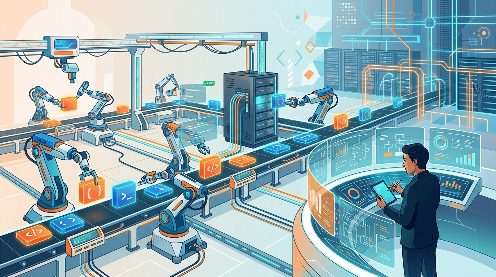

Cloudflare subió la apuesta conceptual: **declaró obsoleto el SDLC** (Software Development Lifecycle) y presentó su reemplazo, el **Agent Development Lifecycle (ADLC)**. El argumento es directo: el modelo tradicional —plan, diseño, implementación, prueba, deploy, mantenimiento— se rompió cuando los agentes de IA empezaron a generar cambios a un volumen que los pipelines humanos no alcanzan a revisar.

## El problema que ataca

El SDLC asume revisiones humanas y pipelines lineales. Pero cuando los agentes producen cambios en masa, los equipos terminan **haciendo cola para correr tests, esperando entornos de staging y revisando logs después de cada run**. Los cuellos de botella ya no están en escribir código, sino en **testing, deployment y mantenimiento**.

## La propuesta ADLC

La idea es invertir el rol humano. En vez de que la gente ejecute cada paso, **los agentes manejan el trabajo a lo largo del ciclo de vida**, mientras los ingenieros:

- Definen **políticas** y restricciones.
- Inspeccionan **evidencia** de lo que los agentes hicieron.
- Controlan el **acceso a sistemas sensibles**.

Para que esto funcione, Cloudflare sostiene que una plataforma ADLC necesita tres cosas: **control programático**, **escala horizontal** y **ejecución basada en eventos**.

## El contexto

Esto no es un paper académico al aire: Cloudflare viene empujando fuerte su stack de agentes (Workers, Agents, Workflows, y el más reciente **Cloudflare OS**, un workspace agéntico para crear apps con el contexto de tu empresa). El ADLC es la capa de narrativa que amarra ese ecosistema.

La lectura para los equipos de DevOps y arquitectura: el debate dejó de ser "¿los agentes nos van a ayudar a programar?" y pasó a ser **"¿cómo rediseñamos el proceso de entrega para un mundo donde el código lo generan agentes en volumen?"**. El SDLC como lo conocíamos —de RAND en 1975 para acá— tiene los días contados en la visión de Cloudflare. Habrá que ver cuánto tarda la industria en comprar el reemplazo.

**Fuente:** InfoQ / Cloudflare — propuesta del Agent Development Lifecycle.
