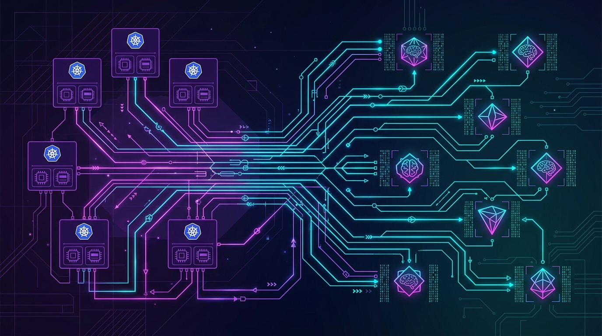

La estandarización de los agentes de IA acaba de dar un salto hacia la infraestructura. El **Technical Oversight Committee (TOC) de la CNCF** abrió una iniciativa formal —la **Initiative 1746**— para evaluar si el **Model Context Protocol (MCP)**, creado por Anthropic, puede convertirse en el **wire spec por defecto para sistemas de agentes distribuidos sobre Kubernetes**.

## Qué implica en concreto

La propuesta no se queda en lo teórico: incluye entregables como **"MCP for Clusters"** y un **Agent CRD**, junto con patrones de gateway. Traducido: la idea es que describir y conectar agentes en un clúster sea tan natural como definir un Deployment o un Service. En vez de que cada vendor invente su propio protocolo de comunicación entre agentes, MCP se posiciona como el candidato común.

## Por qué esto es relevante

Hasta ahora MCP vivía en el mundo de las herramientas y los IDE —el puente entre un modelo y un sistema externo (bases de datos, APIs, archivos). Llevarlo al plano de Kubernetes significa estandarizar cómo **múltiples agentes se descubren, se autentican y se coordinan dentro de un clúster**, algo que hoy es un terreno fértil para soluciones ad-hoc.

Es el mismo arco que ya vimos con otros estándares: primero una especificación crece orgánicamente en un nicho, y cuando la adopción alcanza masa crítica, una fundación como la CNCF la formaliza para el mundo cloud-native.

## Los matices

- MCP es un protocolo joven y en evolución: hace poco hubo cambios importantes en cómo funciona "on the wire" y en el manejo de interacciones bidireccionales. Estandarizarlo ahora implica congelar una versión que todavía se está moviendo.
- El ecosistema de gateways para agentes ya está explotando —proyectos como agentgateway enfocados específicamente en servir MCP y cargas agénticas a escala en Kubernetes—, lo que le da tracción al estándar pero también competencia de facto.

La lectura: la carrera por definir **cómo hablan los agentes entre sí** dejó de ser un problema de aplicaciones y se convirtió en un problema de infraestructura. Y cuando la CNCF se sienta a la mesa, suele significar que la industria ya decidió hacia dónde va.

**Fuente:** Forkast News / CNCF — cobertura de la CNCF TOC Initiative 1746.
